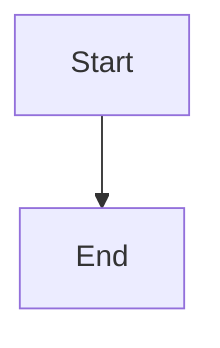

# NetGesucht Blog

A personal blog built with [Hugo](https://gohugo.io/) and the [PaperMod](https://github.com/adityatelange/hugo-PaperMod) theme, deployed to [GitHub Pages](https://pages.github.com/).

## Stack

| Component | Choice |
|-----------|--------|
| Static site generator | [Hugo](https://gohugo.io/) v0.162.1+extended |
| Theme | [PaperMod](https://github.com/adityatelange/hugo-PaperMod) |
| Hosting | [GitHub Pages](https://pages.github.com/) |
| Deployment | [GitHub Actions](.github/workflows/deploy.yml) |
| Diagrams | [Mermaid](https://mermaid.js.org/) (conditional loading via render hook) |

## Quickstart

```shell
# Install Hugo (macOS)
brew install hugo

# Clone with submodules
git clone --recursive <repo-url>
cd hugo_blog

# Start dev server with live reload
hugo server -D

# Build for production
hugo --minify
```

## Writing a Post

Create a new Markdown file in `content/posts/`:

```markdown
---
title: "My Post Title"
date: 2026-06-01
description: "A short description"
tags: ["tag1", "tag2"]
---

Post content here...
```

### Including Images

Place images in the same directory as your post (page bundle):

```
content/posts/my-post/
├── index.md
└── image.png
```

Reference them in Markdown:

```markdown

```

### Mermaid Diagrams

Use fenced code blocks with the `mermaid` language:

````markdown

````

The Mermaid JavaScript library is loaded **only on pages that use it**.

## Deployment

Push to the `main` branch. GitHub Actions automatically builds and deploys to GitHub Pages.

To set up for the first time:
1. Go to your repo **Settings → Pages**
2. Under **Source**, select **GitHub Actions**
3. Push to `main` — the workflow in `.github/workflows/deploy.yml` will handle the rest

## Project Structure

```
.
├── .github/workflows/deploy.yml   # GitHub Actions deploy workflow
├── archetypes/                     # Post archetypes (templates for new content)
├── assets/                         # Unprocessed assets
├── content/
│   └── posts/                      # Blog posts (Markdown)
├── hugo.toml                       # Site configuration
├── layouts/
│   ├── _markup/render-codeblock-mermaid.html  # Mermaid render hook
│   ├── _default/rss.xml                       # RSS override
│   ├── partials/mermaid.html                  # Mermaid script partial
│   └── baseof.html                            # Base template with Mermaid injection
├── static/                         # Static files (copied as-is)
└── themes/PaperMod                 # Theme (git submodule)
```
