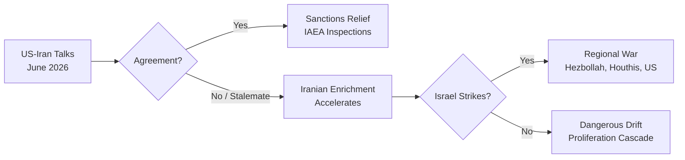
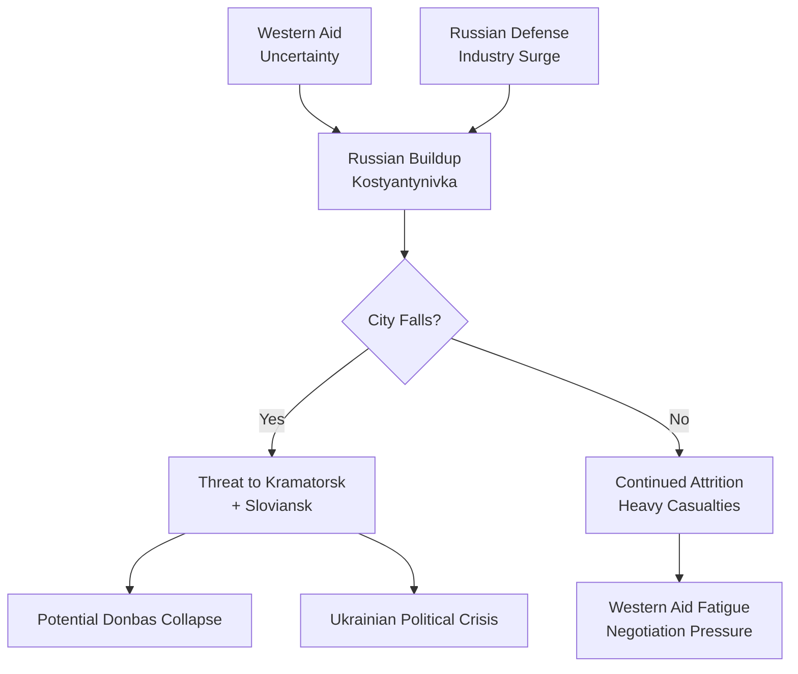
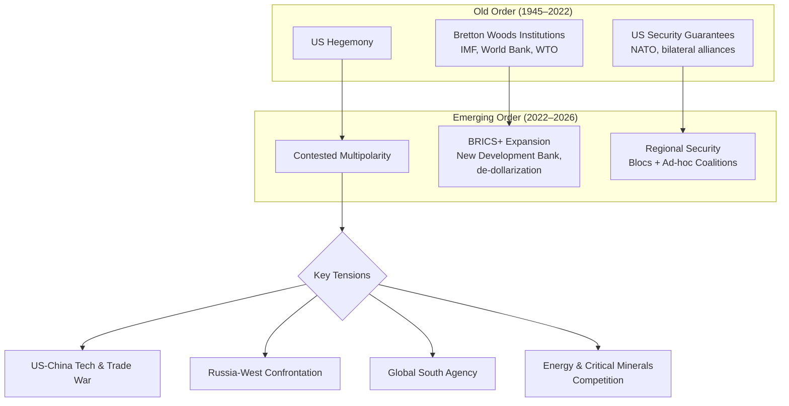

> **Compiled:** June 23, 2026
> **Sources:** BBC News, Associated Press, Reuters, CFR Global Conflict Tracker

---

## Executive Summary

The global geopolitical landscape in mid-2026 is defined by **simultaneous multipolar flashpoints**: a US–Iran diplomatic dance with nuclear inspections at stake, a grinding Russian offensive in eastern Ukraine, an Israeli military campaign in Gaza and southern Lebanon that a UN commission has labeled "genocide," a sudden leadership vacuum in the UK after Keir Starmer's resignation, and a structural reordering of the global order with Europe rearming, BRICS expanding, and the Global South asserting agency. The world is navigating a **contested transition** from US-led unipolarity toward an uncertain multipolar equilibrium — without any clear institutional framework to manage the transition safely.

---

## Table of Contents

1. [Iran Nuclear Talks: Diplomacy or Stalling?](#1-iran-nuclear-talks-diplomacy-or-stalling)
2. [Russia–Ukraine War: The Eastern Grinding Floor](#2-russia-ukraine-war-the-eastern-grinding-floor)
3. [Middle East: Israel, Gaza, Lebanon & the UN Genocide Inquiry](#3-middle-east-israel-gaza-lebanon--the-un-genocide-inquiry)
4. [United Kingdom: Starmer Resigns, Labour in Crisis](#4-united-kingdom-starmer-resigns-labour-in-crisis)
5. [The United States: Trump Administration, Midterms & Institutional Turmoil](#5-the-united-states-trump-administration-midterms--institutional-turmoil)
6. [Europe: Rearmament, Energy & the Heatwave Crisis](#6-europe-rearmament-energy--the-heatwave-crisis)
7. [Latin America: Colombia's Rightward Pivot, Mexico–Cuba Oil Gambit](#7-latin-america-colombias-rightward-pivot-mexico-cuba-oil-gambit)
8. [Africa: South Sudan Elections, DRC Ebola, Sahel Security Vacuum](#8-africa-south-sudan-elections-drc-ebola-sahel-security-vacuum)
9. [Asia: Myanmar Atrocities, China's Regional Assertiveness](#9-asia-myanmar-atrocities-chinas-regional-assertiveness)
10. [The Multipolar Order: BRICS, NATO, Energy & Critical Minerals](#10-the-multipolar-order-brics-nato-energy--critical-minerals)
11. [Climate Geopolitics: Heatwaves, Adaptation & Migration Pressure](#11-climate-geopolitics-heatwaves-adaptation--migration-pressure)
12. [Strategic Outlook: Risk Assessment & Scenarios](#12-strategic-outlook-risk-assessment--scenarios)

---

## 1. Iran Nuclear Talks: Diplomacy or Stalling?

**Headline:** *"Iran says no new commitments on nuclear sites after Vance says inspectors to be invited back"* — BBC

### What Happened

US Vice President **JD Vance** held direct talks with Iranian representatives at a luxury resort in Switzerland, marking the highest-level face-to-face contact between the Trump administration and the Islamic Republic. The US side claimed progress — specifically that Iran would invite IAEA inspectors back to monitored sites. However, Tehran's foreign ministry quickly clarified it had made **"no new commitments."**

### Analysis

This is a **high-risk diplomatic probe** rather than a breakthrough. Both sides have domestic reasons to appear engaged:

- **Tehran** needs sanctions relief (economy under severe strain) but cannot be seen capitulating ahead of the 2026 presidential succession.
- **Washington** wants to avoid another Middle Eastern war while simultaneously taking a hard line on proliferation — a difficult balance.
- The **Netanyahu factor** complicates everything: Israeli PM has consistently claimed Iran is further along in enrichment than public evidence shows (AP Fact Check confirmed this disconnect).

### Key Risk
A diplomatic failure could trigger an Israeli preemptive strike on Iranian nuclear facilities — which would ignite a regional war drawing in Hezbollah, Yemen's Ansar Allah (Houthis), and potentially US forces.

---

## 2. Russia–Ukraine War: The Eastern Grinding Floor

**Headline:** *"Russian troop build-up threatens city seen as key to seizing Ukraine's Donbas"* — BBC

### Current Frontline Situation

The war — now in its fourth calendar year — has entered another critical phase. Russian forces have massed near **Kostyantynivka**, a city in Donetsk Oblast that serves as a gateway to Ukraine's remaining strongholds in the eastern Donbas region. If the city falls, Russian forces would push toward **Kramatorsk and Sloviansk**, completing the capture of the entire Donbas — a stated war aim since 2022.

### Military Dynamics

- **Russia** is using its advantage in artillery, glide bombs, and manpower to grind forward on a broad front.
- **Ukraine** faces acute ammunition shortages and declining Western aid volumes, compounded by political uncertainty in the US (midterm elections) and Europe (UK leadership crisis).
- Both sides have demonstrated limited capacity for large-scale breakthrough operations — the war is a **war of attrition**.

### Broader Implications

The conflict continues to reshape European security architecture:
- **NATO** has absorbed Finland and Sweden; defense spending is rising across the alliance.
- **Germany** plans to buy 40% of tank manufacturer **KNDS (Leopard)** , signaling a structural shift toward sustained defense industrial investment — a historic break from post-WWII reticence.
- The war has accelerated EU defense integration, including joint procurement and the European Defence Fund.

---

## 3. Middle East: Israel, Gaza, Lebanon & the UN Genocide Inquiry

**Headline:** *"UN commission of inquiry says Israel committing genocide in Gaza by deliberately targeting children"* — BBC

### Gaza Conflict

The UN Commission of Inquiry (COI) — a three-member expert panel — released a report stating that Israel is **committing genocide in Gaza**, specifically citing deliberate targeting of children. Israel rejected the report as a "libellous sham." The conflict, ongoing since October 2023, has resulted in catastrophic civilian casualties and the destruction of vast areas of Gaza's infrastructure.

### Southern Lebanon

BBC correspondent Hugo Bachega gained rare access to **Israeli-occupied southern Lebanon**, traveling with a humanitarian convoy. The report describes destroyed villages and an ongoing Israeli military presence — a flashpoint that risks a second front.

### Regional Dynamics

| Actor | Position |
|-------|----------|
| **Israel** | Military operations in Gaza + southern Lebanon; rejects UN findings |
| **Palestinian Authority** | Marginalized; unable to govern Gaza |
| **Hezbollah** | Engaged in limited cross-border fire from Lebanon |
| **Iran** | Supports resistance axis; nuclear talks complicate calculations |
| **US** | Provides diplomatic cover + military aid; JD Vance talks with Iran attempt to de-escalate region-wide |

### Risk
A full Israel–Hezbollah war would devastate Lebanon and could draw in Iran directly. Combined with a potential Israeli strike on Iranian nuclear facilities — the entire Middle East could ignite simultaneously.

---

## 4. United Kingdom: Starmer Resigns, Labour in Crisis

**Headline:** *"Keir Starmer went from election landslide to downfall after his supporters deserted him"* — AP

### What Happened

**Keir Starmer** — who led Labour to a landslide victory in 2024 (ending 14 years of Conservative rule) — has **resigned as Prime Minister**. His downfall is attributed to a collapse in support among the very coalition that elected him: progressives, union members, and younger voters who felt betrayed by policy reversals.

**Andy Burnham**, the Mayor of Greater Manchester, has confirmed his candidacy to succeed Starmer as Labour leader. The leadership contest will determine the next Prime Minister.

### Why It Matters

- The UK — a permanent UN Security Council member, nuclear power, and major NATO ally — is entering a period of **political instability** at a time when Europe needs cohesion.
- Brexit still reverberates: the UK's foreign policy posture remains in flux between "Global Britain" rhetoric and reduced actual capacity.
- The **economic picture** is fragile: inflation, public sector strikes, and strained public services.

### Possible Next PMs

| Candidate | Profile | Likelihood |
|-----------|---------|------------|
| **Andy Burnham** | Centrist, popular with northern voters, strong name recognition | High |
| **Others** | Several Labour figures may challenge; depends on factional dynamics | TBD |

---

## 5. The United States: Trump Administration, Midterms & Institutional Turmoil

### Midterm Elections 2026

The US is in the middle of a consequential **midterm election cycle**. Key trends:
- **Immigration enforcement** is the defining issue — a federal judge has halted the Trump administration's attempt to subpoena Minnesota Governor Tim Walz.
- **Tucker Carlson** announced he will **no longer support the Republican Party**, reflecting fractures in the conservative coalition.
- The **DEA scandal** — permitting "staggering amounts of fentanyl to hit streets" — is a political liability.

### Federal Reserve & Economic Policy

- **Alan Greenspan**, former Federal Reserve Chairman (1987–2006), died at 100.
- Current Fed Chair **Kevin Warsh** faces a dilemma: a "quieter" Fed with less forward guidance may cause **higher market volatility and interest rates** (AP analysis).
- Tariff policy remains a tool of Trump's foreign policy — with impacts on global trade flows, particularly with China.

### Domestic Institutions Under Stress

- The **Supreme Court** reinstated the murder conviction in the Etan Patz case.
- The **Lincoln Memorial Reflecting Pool** was drained after vandalism — a minor but symbolic indicator of political temperature.
- **National Guard** and **US Park Police** patrol the Reflecting Pool area.

### Foreign Policy Under Trump 2.0

The Trump administration continues its transactional approach:
- **Engagement with Iran** (Vance talks) — trying to avoid another war.
- **Endorsement of Colombia's Abelardo de la Espriella** — anticipates better relations.
- **Confrontational posture toward China** — trade tariffs and technology restrictions continue.
- **Mixed signals on NATO** — European allies remain uncertain about US commitment.

---

## 6. Europe: Rearmament, Energy & the Heatwave Crisis

### Defense & Security

- **Germany plans to buy 40% of KNDS** (the Leopard tank manufacturer), joining France as a strategic partner — a historic shift toward national defense industrial ownership.
- **EU defense spending** is rising across the board, driven by the Russian threat and US uncertainty.
- **NATO's eastern flank** is substantially reinforced; Finland and Sweden are now full members.

### Energy & Climate

- **Germany is re-examining coal power** — as natural gas prices remain high, the planned coal phaseout may slip.
- **Heatwave Crisis**: France issued **red heatwave alerts** for half the country; 40 people drowned in heatwave-related incidents. The UK braces for its **hottest June day ever** (potentially surpassing 35.6°C from 1976).
- Romania faced a **national cyberattack** that forced 100 hospitals to switch to pen and paper.

### Political Landscape

- **UK leadership crisis** (see section 4) creates uncertainty.
- **France** managing heatwave crisis domestically.
- **Far-right parties** continue to gain ground in several EU member states, affecting migration and EU integration policies.

---

## 7. Latin America: Colombia's Rightward Pivot, Mexico–Cuba Oil Gambit

### Colombia

**Abelardo de la Espriella** leads preliminary results in Colombia's presidential election. He had **Donald Trump's endorsement**. This represents a potential **shift to the right** in a key South American nation — following leftist Gustavo Petro's term. US-Colombia relations likely to warm under de la Espriella.

### Mexico–Cuba

Mexico's President seeks to **restart oil shipments to Cuba** as the island's economic crises deepen. This is a significant geopolitical maneuver:
- **Challenges the US embargo** on Cuba.
- **Reasserts Mexican sovereignty** in foreign policy.
- Highlights Cuba's desperate need for energy and the failure of the island's economy under sustained sanctions.

### Other Regional Notes

- **Argentina**: A viral phenomenon has young people identifying as animals ("therians") — a cultural curiosity that also reflects deeper social dislocation.
- The region continues to grapple with **deforestation, drug trafficking routes**, and **Chinese economic penetration**.

---

## 8. Africa: South Sudan Elections, DRC Ebola, Sahel Security Vacuum

### South Sudan

- **December 2026 elections** have been set after years of delay.
- This would be South Sudan's **first-ever national election** since independence in 2011.
- Logistical challenges, continued tensions, and violence could still scupper the plan.

### Democratic Republic of Congo

- A new **Ebola outbreak** involves a rare species of the virus and is located in a **conflict-affected area** — making containment exceptionally difficult.

### Sahel Region

The security vacuum left by French withdrawal from Niger, Mali, and Burkina Faso continues to be filled by:
- **Russian Wagner/Africa Corps** mercenaries.
- **Local jihadist groups** expanding territorial control.
- **Military juntas** consolidating power.

### Myanmar (Southeast Asia)

- UN report: **Myanmar's military killed over 700 civilians in six months**, including 153 children.
- The civil war between the junta and resistance forces continues with no end in sight.
- The crisis has broader implications for ASEAN unity and regional refugee flows.

---

## 9. Asia: Myanmar Atrocities, China's Regional Assertiveness

### China

- **China's strategic posture** remains assertive in the South China Sea, Taiwan Strait, and along the Indian border.
- **Economic statecraft**: China continues to use trade, debt diplomacy, and infrastructure investment (Belt and Road) to build influence.
- **Technology war** with the US continues: semiconductor restrictions, AI competition.
- The **Dettol ad controversy in China** (backlash over "toxic men" messaging) reflects heightened gender and social tensions.

### India

- India navigates a delicate balance between the **Quad** (US, Japan, Australia) and its longstanding ties with **Russia**.
- **Border tensions with China** remain unresolved in the eastern Ladakh region.

### North Korea

- No major headline in this cycle, but the peninsula remains a flashpoint with continued missile testing.

---

## 10. The Multipolar Order: BRICS, NATO, Energy & Critical Minerals

### The Structural Shift

The global order is transitioning from **US-led unipolarity** toward a **contested multipolar system**:

### BRICS Expansion

BRICS (Brazil, Russia, India, China, South Africa) has admitted new members and is exploring:
- **Alternative payment systems** to reduce dollar dependence.
- A **joint development bank** competing with Western-led institutions.
- **De-dollarization** efforts among member states.

### Energy Geopolitics

- **Russia** has successfully redirected energy exports to China and India.
- **Middle Eastern producers** (Saudi Arabia, UAE, Qatar) are diversifying partners.
- **Critical minerals** (lithium, rare earths, cobalt) are becoming strategic assets — the new oil of the 21st century.

---

## 11. Climate Geopolitics: Heatwaves, Adaptation & Migration Pressure

### Current Crisis

- **Record heatwave across Europe** — France, UK, Italy, Germany.
- **Drowning deaths in France**: 40 people died in heatwave-related incidents.
- **"Red alert"** issued across half of France.
- The UK braces for its hottest June day in history.

### Structural Dimensions

Climate change is increasingly a **geopolitical multiplier**:
- **Migration pressure** from the Global South to the North.
- **Water and food security** crises in vulnerable regions (Sahel, Horn of Africa, South Asia).
- **Arctic opening**: New shipping routes create strategic competition among Russia, China, and NATO.
- **Insurance and adaptation costs** are becoming unaffordable for many developing nations.

### Key Study

- **Mexico, Italy and others** now experience up to **two more months of heat stress** than in the 1970s (AP study).
- The **National Science Foundation** reversed a decision to dismantle the oceans-monitoring network after public outcry — showing the political sensitivity of climate data.

---

## 12. Strategic Outlook: Risk Assessment & Scenarios

### Risk Matrix

| Risk | Probability | Impact | Timeframe |
|------|-------------|--------|-----------|
| Israeli strike on Iran nuclear sites | Medium | Catastrophic (regional war) | 6–12 months |
| Russian capture of Donbas | High | Major (Ukrainian collapse) | 3–6 months |
| UK political instability | High | Moderate (NATO/Europe cohesion) | Immediate |
| US–China Taiwan confrontation | Low-Medium | Catastrophic (global war) | 12–24 months |
| Europe heatwave deaths cascade | High | Moderate (public health crises) | Immediate (weeks) |
| Sahel state collapse | High | Moderate (migration, terrorism) | Ongoing |
| Cyberattack on critical infrastructure | High | High (economic + safety) | Ongoing |

### Scenario Analysis

**Scenario A — Escalation Spiral (30% probability)**
- Iran talks fail → Israeli strike → regional war → oil price spike → global recession.
- Putin capitalizes on Western distraction → intensified efforts in Ukraine.

**Scenario B — Managed Containment (45% probability)**
- Iran talks produce limited agreement → crisis deferred.
- Ukraine war continues as grinding attrition → no decisive breakthrough.
- US midterms produce divided government → foreign policy stalemate.
- Climate adaptation accelerates but not enough.

**Scenario C — Positive Disruption (15% probability)**
- Iran framework agreement opens broader Middle East détente.
- Ukraine peace negotiations gain traction (unlikely in 2026).
- Multilateral institutions reform to include rising powers more effectively.

**Scenario D — Black Swan (10% probability)**
- A major cyberattack paralyzes financial systems.
- A pandemic resurgence (Ebola, new variant).
- A Fukushima-scale nuclear incident in a conflict zone.

---

## Conclusion

The geopolitical landscape in **June 2026** is characterized by **simultaneous stress across multiple domains**:

1. **Military conflict** in Ukraine, Gaza, Lebanon, and Myanmar — with no off-ramps in sight.
2. **Diplomatic fragility** — US–Iran talks, UK leadership vacuum, and uncertain US commitment to allies.
3. **Economic reordering** — de-dollarization, critical mineral competition, European rearmament.
4. **Climate emergency** — heatwaves, droughts, and adaptation failures that will increasingly intersect with security.
5. **Institutional erosion** — international law, the UN system, and democratic norms are under assault from multiple directions.

The defining question is whether the existing international system can **absorb and manage** these shocks simultaneously, or whether a cascading failure in one domain will trigger contagion across others.

> *"The old world is dying, and the new world struggles to be born: now is the time of monsters."* — Antonio Gramsci (adapted)

---

*Report compiled by NetGesucht Code — June 23, 2026*
*Sources: BBC News, Associated Press, AP Fact Check, Reuters, CFR Global Conflict Tracker*
