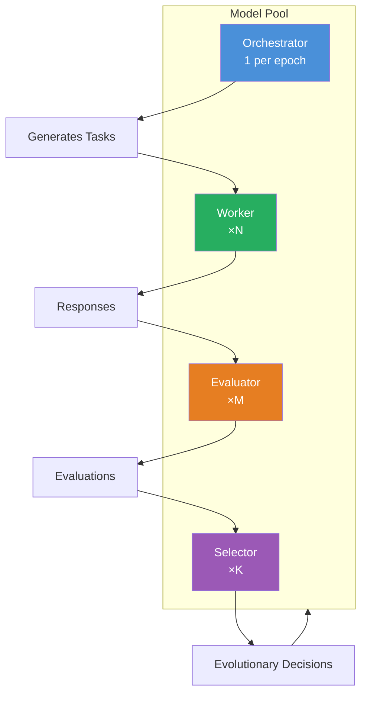
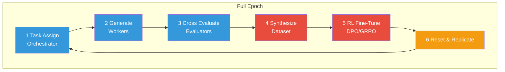
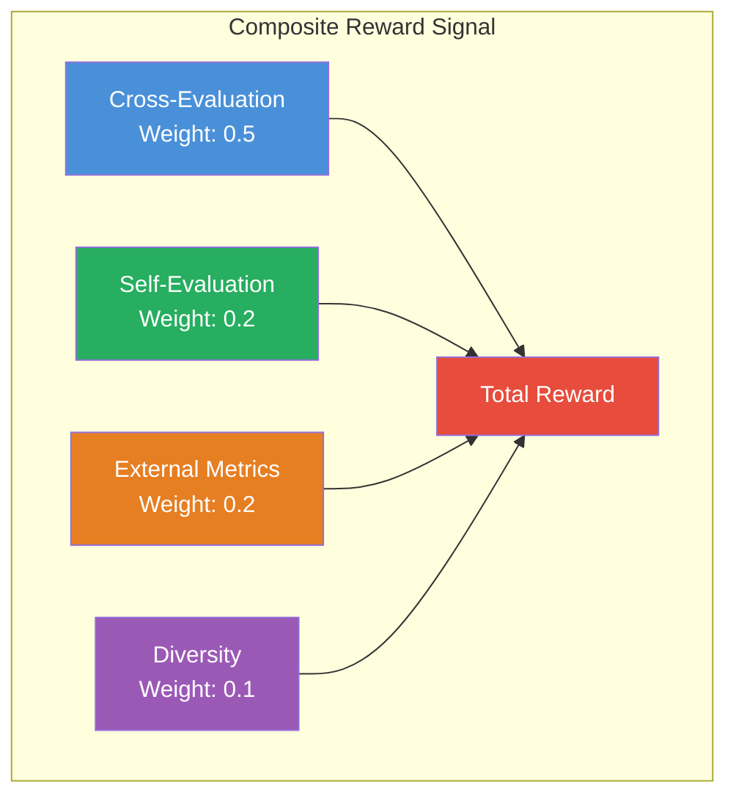
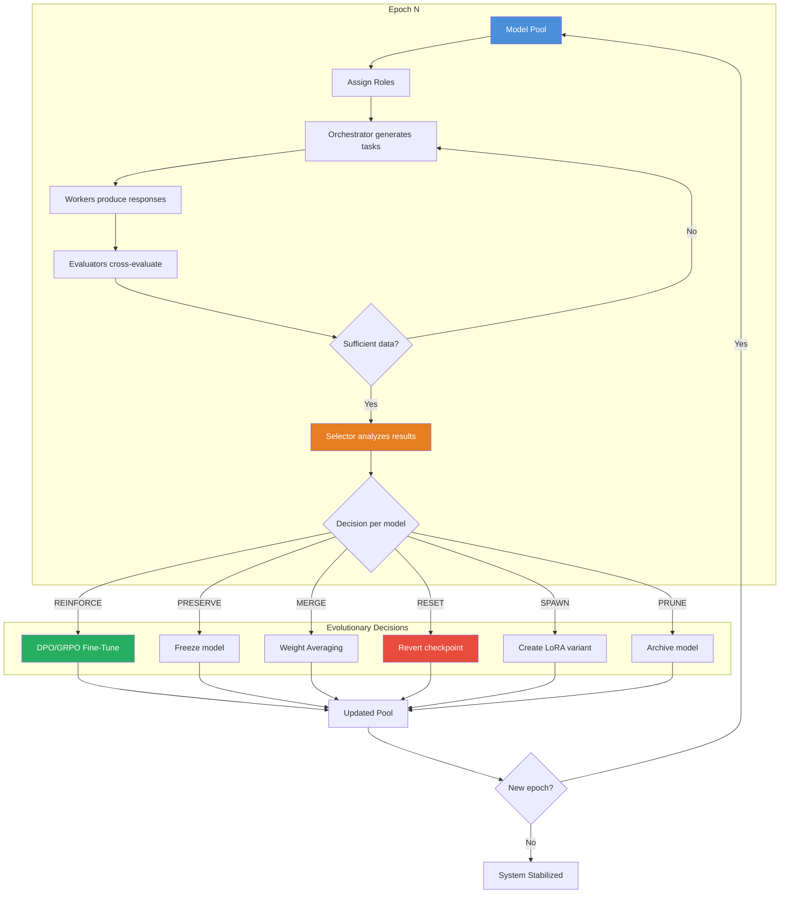
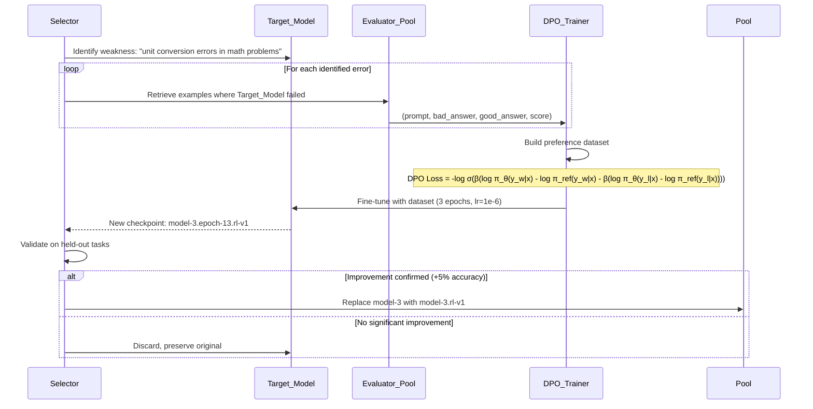
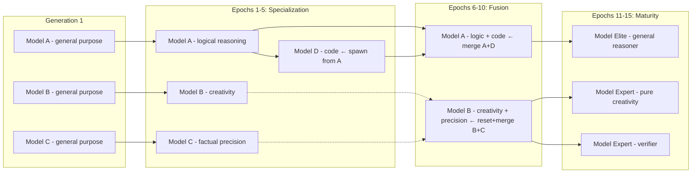

# RL-MoE Evolution: Architecture for Recursive Self-Improvement Multi-Agent System

> **Status:** Conceptual exploration — theoretical design with references to existing techniques  
> **Date:** 2026-07-18  
> **Inspiration:** AlphaGo self-play, RLAIF, DPO/GRPO, SPIN, Mixture of Experts, Neuroevolution

---

## 1. Executive Summary

This document explores a system where **multiple language models (LLMs) recursively improve their capabilities** through a cycle of:

1. **Task assignment** between models
2. **Response generation** by worker models
3. **Cross-evaluation** of responses between models
4. **Preference dataset synthesis** for RL fine-tuning
5. **Fine-tuning** of specific models using RL (DPO/GRPO)
6. **Reset and replication** of knowledge across models
7. **Evolutionary selection** (best models replicate, worst ones get refined)

The system resembles an **evolutionary Mixture of Experts**, where experts are not static but continuously improve through interaction and competition.

---

## 2. Core Concept

### 2.1 The Metaphor: From Deep Blue to an Evolutionary Ecosystem

| System | Mechanism | Limitation |
|--------|-----------|------------|
| AlphaGo | Self-play → RL → single agent improvement | One model, one domain |
| RLAIF | AI evaluates AI → preference dataset | Unidirectional evaluation |
| MoE | Multiple experts, one router | Static experts post-training |
| **RL-MoE Evolution** | Multiple models mutually evaluate and improve each other in a cycle | **Novel: distributed evolution** |

### 2.2 Fundamental Principles

1. **Cyclicity**: The system operates in epochs. Each epoch: generate → evaluate → fine-tune → reset
2. **Distribution**: No single "master" model. Improvement emerges from peer-to-peer interactions
3. **Self-selection**: Models collectively decide who needs improvement and in what direction
4. **Preservation vs. Innovation**: "Elite" models are preserved, "explorer" models experiment
5. **Emergent Specialization**: Models naturally develop competence niches

---

## 3. System Architecture

### 3.1 Model Roles



#### Orchestrator (1 per epoch)
- **Function:** Decompose high-level objectives into concrete tasks
- **Input:** High-level goal + pool performance history
- **Output:** Set of tasks with success criteria
- **Selection:** The model with the best composite score from the previous epoch

#### Worker (N per epoch)
- **Function:** Execute assigned tasks, generate responses
- **Input:** Task description + context
- **Output:** Structured response
- **Special note:** Multiple workers receive the same task to generate diversity

#### Evaluator (M per epoch — preferably M ≥ 2)
- **Function:** Evaluate worker responses using rubrics
- **Input:** Original task + worker response + evaluation rubric
- **Output:** Numeric score + justification + preference signal (A > B)
- **Key:** Produces the preference dataset for RL fine-tuning

#### Selector (K per epoch)
- **Function:** Analyze results and determine:
  - Which model(s) need fine-tuning
  - What direction of improvement (based on systematic errors)
  - Which model(s) deserve "elite" status (preserved)
  - Which model(s) should be reset to a previous checkpoint
- **Input:** Complete epoch evaluations + evolutionary history
- **Output:** Fine-tuning and replication decisions

### 3.2 Model Pool and States

Each model in the pool has a **state** that determines its behavior:

```yaml
Model:
  id: "model-7"
  base: "mistral-7b"
  checkpoint_path: "/models/checkpoints/model-7.epoch-12.gguf"
  current_state: "worker"  # orchestrator | worker | evaluator | selector
  metrics:
    composite_score: 0.82
    specialization: "logical-reasoning"
    accuracy: 0.87
    diversity: 0.65  # how different its responses are from the average
  lineage: "model-3 → model-5 → model-7"
  generation: 3  # how many improvement iterations it has undergone
  epoch_created: 7
  epochs_without_improvement: 2  # if > threshold → reset or merge
```

### 3.3 Epoch Dynamics

Each system epoch follows this structure:

```
Epoch N:
  1. SELECT: Evaluate pool state → determine roles
  2. PLAN: Orchestrator generates tasks
  3. GENERATE: Workers produce responses
  4. EVALUATE: Evaluators score and compare
  5. ANALYZE: Selectors decide improvements
  6. TRAIN: RL fine-tuning of selected models
  7. RESET: Partial replication, resets, knowledge merging
  8. REPEAT: New epoch with updated pool
```

---

## 4. Iteration Lifecycle

### 4.1 Detailed Pipeline



### 4.2 Step by Step

#### Step 1: Task Assignment (Orchestrator)

The Orchestrator receives a high-level goal, for example: *"Improve the mathematical reasoning capability of the pool"*.

It generates tasks like:
```json
[
  {
    "id": "task-001",
    "type": "step-by-step-reasoning",
    "prompt": "Solve: A train leaves station X at 60 km/h...",
    "criteria": ["numerical_accuracy", "clarity_of_steps", "justification"],
    "difficulty": 0.7,
    "assigned_to": ["model-3", "model-7", "model-12"]
  },
  {
    "id": "task-002",
    "type": "formal-proof",
    "prompt": "Prove that the square root of 2 is irrational...",
    "criteria": ["logical_validity", "completeness", "elegance"],
    "difficulty": 0.85,
    "assigned_to": ["model-7", "model-9"]
  }
]
```

#### Step 2: Generate (Workers)

Each worker independently produces responses for their assigned tasks.

```yaml
task-001:
  model-3_response: "Step 1: Calculate relative speed..."
  model-7_response: "Using d = rt, we have..."
  model-12_response: "Let x be the distance..."
```

#### Step 3: Cross-Evaluate (Evaluators)

Each evaluator receives response pairs (or full sets) and produces:

```yaml
evaluator_model-5:
  comparison_task-001:
    winner: "model-7"
    loser: "model-3"
    score_model-7: 0.92
    score_model-3: 0.45
    justification: "model-7 used correct time conversion..."
    weakness_model-3: "Failed to account for train B's head start"
  comparison_task-001_2:
    winner: "model-7"
    loser: "model-12"
    score_model-7: 0.88
    score_model-12: 0.76
    justification: "Both correct, model-7 more elegant"
```

#### Step 4: Synthesize Dataset (Selector/Orchestrator)

Evaluations are consolidated into a preference dataset for RL fine-tuning:

```json
{
  "prompt": "Solve: A train leaves station X at 60 km/h...",
  "chosen": "Step 1: Convert 45 minutes to 0.75 hours...",
  "rejected": "60 km/h * 45 = 2700 km (WRONG: unit mismatch)",
  "source_evaluator": "model-5",
  "signal_strength": 0.85,
  "error_type": "unit-conversion",
  "model_to_improve": "model-3"
}
```

#### Step 5: RL Fine-Tune

Apply **DPO** (Direct Preference Optimization) or **GRPO** (Group Relative Policy Optimization) to the selected model:

```python
# Conceptual pseudocode
dataset = build_preference_dataset(evaluations, target_model="model-3")
model_3 = load_model("model-3")
for epoch in range(3):
    for batch in dataset:
        # DPO loss: max log(sigma(beta * (reward_chosen - reward_rejected)))
        loss = dpo_loss(model_3(batch.prompt), batch.chosen, batch.rejected)
        loss.backward()
        optimizer.step()
save_checkpoint(model_3, "model-3.epoch-13.rl-v1")
```

**Why DPO over PPO:**
- No separate reward model needed (the evaluations ARE the reward)
- More computationally stable
- Better for iterative fine-tuning with small datasets
- GRPO is an alternative when training with groups without a reward model

#### Step 6: Reset & Replicate

This critical phase distinguishes this system from linear fine-tuning:

```yaml
pool_reset_epoch_13:
  action_on_model-3:
    type: "reinforce"  # fine-tuned with DPO
    new_checkpoint: "model-3.epoch-13.rl-v1"
    metrics_delta: {accuracy: +0.05, diversity: -0.02}

  action_on_model-7:
    type: "preserve_elite"
    checkpoint: "model-7.epoch-12"  # unchanged
    reason: "Best performance, do not intervene"

  action_on_model-12:
    type: "reset_and_merge"
    new_checkpoint: "model-12.epoch-13"
    origin: "model-7.epoch-12 + model-3.epoch-13"
    method: "interpolation / weight averaging"
    reason: "Consistently low performance, merge knowledge"

  action_on_model-9:
    type: "reset_hard"
    new_checkpoint: "model-9.base"  # revert to base
    reason: "Overfitting to wrong niche, restart"
```

---

## 5. RL Fine-Tuning Mechanism

### 5.1 Method Comparison

| Method | Reward Model | Stability | Dataset Needed | Maturity | Ideal for... |
|--------|-------------|-----------|----------------|----------|-------------|
| **PPO** | Yes (separate) | Low-medium | Medium | Very high | Systems with external reward model |
| **DPO** | No (implicit) | High | Binary preferences | High | Cross-model evaluations (our case) |
| **GRPO** | No (groups) | High | Response groups | Medium | Multiple workers per task (our case) |
| **KTO** | No | High | Unpaired data | Medium | When no direct pairs available |
| **ORPO** | No | High | Single forward pass | Low | Rapid experimentation |

### 5.2 Recommended Architecture: GRPO with Multi-Evaluator Signal

```
For each task T and worker group W₁...Wₙ:

  1. Workers produce responses R₁...Rₙ
  2. Evaluators E₁...Eₘ score each response (score 0-1)
  3. Aggregate score = weighted average (by evaluator confidence)
  4. GRPO loss: 
     - Advantage for each response = (score_i - mean(scores)) / std(scores)
     - Loss = -E[log π_θ(R_i|T) * advantage_i]
     - KL regularization against π_ref
  5. Policy π_θ updated → new checkpoint of fine-tuned worker
```

### 5.3 Advantage of Multi-Evaluator Approach

```
Typical single-evaluator error: systematic bias
Example: evaluator model-5 prefers long responses

Solution: Multiple evaluators with different backgrounds
- model-5 (specialized in brevity)
- model-9 (specialized in depth)
- model-3 (specialized in rigor)

Each gives different score → aggregation reduces bias
Consensus emerges from diversity
```

---

## 6. Selection and Evolution

### 6.1 Self-Selection Mechanism

The **Selectors** analyze the pool and decide evolutionary actions. This is one of the most innovative aspects of the system.

```
Selector Input:
- Performance matrix: model × task × score
- Evolutionary history: what changes were made and with what result
- Pool diversity: are models converging or diverging?

Possible Decisions:

1. REINFORCE → Fine-tune the model on its weaknesses
   - Signal: consistently low score in a certain category
   - Action: DPO/GRPO with data where that model failed

2. PRESERVE → Do not touch, it's elite
   - Signal: top performer across multiple categories
   - Action: freeze, use as evaluator/reference

3. MERGE → Combine knowledge from two models
   - Signal: two models with complementary strengths
   - Action: weight averaging or TIES-merging
   - Example: model-A (reasoning) + model-B (creativity)

4. RESET → Revert to previous checkpoint
   - Signal: degradation after fine-tuning (catastrophic forgetting)
   - Action: load previous checkpoint, possibly with minor adjustment

5. SPAWN → Create variant of an elite model
   - Signal: need to explore alternative directions
   - Action: clone elite model + small mutation (different LoRA)

6. PRUNE → Remove redundant model
   - Signal: another model outperforms it on all metrics
   - Action: archive, free resources
```

### 6.2 Evolutionary Algorithm

```
Algorithm: RL-MoE Evolution (per epoch)

Input: Pool P of n models, tasks T
Output: Improved Pool P'

1. Assign roles (orchestrator, workers, evaluators, selectors)
   - Based on historical performance + forced rotation

2. Orchestrator generates current tasks T_actual

3. For each task t ∈ T_actual:
   a. Assigned Workers W generate responses R_w
   b. Evaluators E score R_w and generate comparisons
   c. Consolidate preference signals

4. For each model m ∈ P:
   a. Calculate composite_score(m) = f(task_performance, diversity_contribution)
   b. If composite_score(m) < improvement_threshold:
      - Build preference dataset D_m where m was weak
      - Fine-tune m using DPO/GRPO → m'
      - Validate m' on held-out tasks
      - If m' improves over m: replace m with m'
      - If not: preserve m, mark "epochs_without_improvement += 1"

5. For models with epochs_without_improvement > max:
   - Apply MERGE with complementary model, or HARD RESET

6. For elite models (top-K):
   - Optional: SPAWN for exploration

7. Pool P' = surviving models + new variants

8. Preserve top-1 model as "anchor" (never reset)
```

### 6.3 Diversity Preservation

A risk is that all models converge to the same local optimum. Countermeasures:

1. **Diversity Reward**: Bonus in evaluation for responses different from pool average
2. **Forced Specialization**: Assign certain task types only to certain models
3. **Niche Protection**: If a model is the only good one in a category, preserve it even if global score is low
4. **Exploration Bonus**: Models exploring novel directions receive temporary protection

---

## 7. Self-Evaluation and Reward

### 7.1 Reward Signal Sources



### 7.2 The Reward Hacking Problem

**Risk:** Evaluators learn to give high scores to responses that resemble their own (self-similarity bias).

**Mitigations:**
- Evaluators never evaluate their own responses
- Evaluators rotate each epoch (no one is a permanent evaluator)
- Multiple evaluators per response (M ≥ 2, forced disagreement)
- Evaluators are models from different "lineage" than workers
- Occasionally inject human evaluation as ground truth

### 7.3 Reward Shaping

The composite reward is calculated:

```
total_reward(model_i, task_j) = 
    w_cross * avg_evaluator_score(model_i, task_j) +
    w_self * self_score(model_i, task_j) +
    w_external * external_metric(task_j) +
    w_diversity * diversity_bonus(model_i, pool)
```

Where weights `w_*` can evolve between epochs based on which signal best correlates with real improvement.

---

## 8. System Diagrams

### 8.1 General Flow Diagram



### 8.2 Fine-Tuning Cycle



### 8.3 Evolutionary MoE



---

## 9. Implementable vs. Speculative Components

| Component | Status | Existing Technology | Difficulty |
|-----------|--------|---------------------|-----------|
| **Task generation by LLM** | ✅ Implementable | Any LLM with careful prompting | Low |
| **Cross-evaluation between models** | ✅ Implementable | RLAIF already demonstrated (Anthropic, Google) | Medium |
| **DPO/GRPO fine-tuning** | ✅ Implementable | TRL (HuggingFace), Axolotl, Unsloth | Medium |
| **Weight averaging (model merging)** | ✅ Implementable | MergeKit, TIES, DARE | Low |
| **Multi-evaluator with aggregation** | ✅ Implementable | Ensemble methods, voting systems | Medium |
| **Self-selection of models to improve** | ⚠️ Partial | Requires heuristics + experimentation | High |
| **Complete autonomous cycle** | ⚠️ Partial | Requires orchestration (Temporal, Airflow, or custom) | High |
| **Knowledge reset and replication** | ⚠️ Partial | Model merging exists, conditional reset doesn't | High |
| **Diversity reward/shaping** | ⚠️ Partial | Known concept, novel application to LLMs | High |
| **MoE evolution without explicit router** | ❌ Speculative | Novel idea, no direct precedent | Very High |
| **Self-evaluation without reward hacking** | ❌ Speculative | Open problem in RLHF/RLAIF | Very High |
| **Emergent niche selection** | ❌ Speculative | Inspired by natural ecosystems | Very High |

---

## 10. MVP: Minimum Viable Prototype

### 10.1 MVP Scope

A concrete experiment that can be built with existing technology:

```
MVP: 2 base models, 1 task, 3 epochs, manual evaluation of results

Base models: llama-3.2-3B and mistral-7b (or any accessible pair)
Single task: "Solve grade-school math word problems" (GSM8K)
Framework: TRL (HuggingFace) + Axolotl for fine-tuning
Orchestration: Python script (Airflow is overkill for MVP)
Evaluation: GSM8K accuracy as objective external metric
```

### 10.2 MVP Architecture

```python
# MVP Pseudocode

class RLMoeMVP:
    def __init__(self):
        self.models = {
            "worker_A": load_base_model("llama-3.2-3b"),
            "worker_B": load_base_model("mistral-7b"),
        }
        self.evaluator = load_base_model("llama-3.2-3b")  # same model, different role
        self.dataset = load_gsm8k()
        self.history = []

    def epoch(self, task_set):
        # 1. Workers generate responses
        responses = {}
        for name, model in self.models.items():
            responses[name] = model.generate(task_set)
        
        # 2. Evaluator compares
        preferences = self.evaluator.compare(responses, task_set)
        
        # 3. Identify weakest model
        weak_model = self.identify_weakest(preferences)
        
        # 4. Build preference dataset
        dpo_dataset = self.build_dpo_dataset(preferences, weak_model)
        
        # 5. Fine-tune weak model
        self.models[weak_model] = self.dpo_train(
            self.models[weak_model], dpo_dataset
        )
        
        # 6. Evaluate progress
        scores = self.evaluate_all(gsm8k_test)
        self.history.append(scores)

    def run(self, epochs=3):
        for e in range(epochs):
            tasks = self.sample_tasks(gsm8k_train, n=50)
            self.epoch(tasks)
            print(f"Epoch {e}: {self.history[-1]}")
```

### 10.3 Required Resources

| Resource | MVP | Full Scale |
|---------|-----|-----------|
| **GPUs** | 1× RTX 3090/4090 (24GB) | 4-8× A100 (80GB) |
| **Models** | 2 small models | 8-16 medium/large models |
| **Data** | GSM8K (8K examples) | Benchmarks + synthetic datasets |
| **Time** | Days | Weeks |
| **Code** | ~500 lines Python | Distributed system |
| **Fine-tuning** | LoRA/QLoRA (15 min per epoch) | Full fine-tuning (hours per epoch) |

### 10.4 MVP Risks

1. **Overfitting**: The evaluator may learn to prefer responses similar to itself
   - Mitigation: Evaluator and worker must be different models
2. **Drift**: Fine-tuning may degrade non-target capabilities
   - Mitigation: Evaluation on diverse benchmarks pre/post fine-tuning
3. **Error reinforcement loop**: If evaluator has bias, it amplifies it
   - Mitigation: Periodic human evaluation as ground truth

---

## 11. Technology Gaps

### 11.1 Open Problems

| Gap | Description | Relevance |
|-----|-------------|-----------|
| **Reward Hacking in RLAIF** | LLM evaluators prefer responses similar to themselves | Critical for the system |
| **Catastrophic Forgetting** | Fine-tuning improves task A but degrades B | High (multi-task) |
| **Pool Convergence** | All models end up identical | Critical (destroys MoE) |
| **Diversity Measurement** | How to quantify "how different" a response is? | Medium |
| **Computational Cost** | Training multiple models is prohibitive | High (practical) |
| **Cycle Stability** | The system might oscillate or diverge instead of converging | Critical |
| **Reliable Self-Evaluation** | When can a model evaluate itself without bias? | Very High |
| **Weak Reward Signal** | Cross-evaluations can be noisy | High |

### 11.2 Related Research Directions

| Work | Relationship | Key Difference |
|------|-------------|----------------|
| **SPIN** (Self-Play Fine-Tuning, 2024) | Model fine-tunes against itself as data generator | Single model vs. multi-model |
| **Constitutional AI** (Anthropic, 2022) | Model evaluates against constitution | Unidirectional vs. cross-evaluation |
| **Self-Rewarding Models** (Meta, 2024) | Model generates its own reward | Individual vs. collective reward |
| **Mixture of Agents** (Together AI, 2024) | Multiple models collaborate in generation | Static collaboration vs. evolution |
| **Branch-Train-Merge** (2022-2024) | Train specialized branches and merge | No self-improvement cycle |
| **PALM** (Self-Improvement, 2023) | Self-training with verification | Single cycle vs. recursive |

---

## 12. Relationship with NGBot

### 12.1 Can Synapse use this for self-improvement?

Currently Synapse has a basic **self-improvement** system that:
1. Identifies error patterns in conversations
2. Stores them in semantic memory (MCP)
3. Uses them to improve future responses

**Current limitations:**
- No real fine-tuning (only improved prompting)
- No multiple Synapse instances
- No cross-evaluation between instances
- No evolutionary cycle

### 12.2 Scalability for NGBot

```
Current NGBot → RL-MoE Evolution (if implemented):

1. Multiple Synapse instances (worker models)
   - Each specialized (code, creativity, analysis, etc.)
   - Cross-evaluation between instances on shared tasks

2. Improvement loop:
   - Weekly: instances compete on benchmark tasks
   - Weakness analysis per instance
   - Selective fine-tuning of specific instances
   - Parameter replication from elite instances

3. Challenges for NGBot:
   - Running multiple models locally (Apple Silicon)
   - Token budget (each evaluation costs)
   - Orchestration complexity
```

### 12.3 Immediate Application: Meta-Learning Loop

Without implementing real fine-tuning, Synapse can already benefit from the *philosophy* of the system:

```yaml
Immediate application in Synapse:

1. **Structured self-evaluation**: 
   - Synapse already evaluates its responses using [PLAN/EXECUTE/ASK/DONE]
   - Could add numerical self-evaluation post-response

2. **Cross-session learning** (already exists):
   - MEMORY.md + MCP semantic memory are the "knowledge pool"
   - Memories are the "checkpoints" that persist between sessions

3. **Implicit Selector**:
   - The user decides what works (human feedback as reward)
   - Synapse should explicitly track this feedback

4. **Response diversity**:
   - When ambiguity exists, Synapse could generate multiple approaches
   - Evaluate them internally before presenting the best one
```

---

## 13. Roadmap

### Phase 0: Conceptual Validation (this document) ✅

### Phase 1: Simulated Prototype (1-2 weeks)
- Implement MVP in Python (no GPUs)
- Use existing LLM APIs to simulate workers/evaluators
- Test the cycle with 2-3 API models (GPT-4o-mini, Claude, etc.)
- Validate that the cycle produces measurable improvement

### Phase 2: Real Fine-Tuning (2-4 weeks)
- Integrate TRL/Axolotl for DPO/GRPO locally
- Use small models (Llama 3.2-3B, Phi-3)
- Test with GSM8K or another closed benchmark
- Compare against baseline without cycle

### Phase 3: Extended Pool (1-2 months)
- Scale to 4-6 models with specialization
- Incorporate model merging (MergeKit)
- Test reset/replication cycle
- Evaluate against multiple benchmarks

### Phase 4: Autonomous System (3-6 months)
- Full orchestration (Temporal/Airflow)
- Heuristic self-selection
- Diversity tracking
- Monitoring interface

### Phase 5: NGBot Integration (6-12 months)
- Multiple Synapse instances
- Cross-evaluation between instances
- Automatic prompt/rag fine-tuning
- Human-AI hybrid system in the loop

---

## Appendix A: Glossary

| Term | Definition |
|------|-----------|
| **DPO** | Direct Preference Optimization — RL fine-tuning without reward model |
| **GRPO** | Group Relative Policy Optimization — PPO variant without reward model |
| **MoE** | Mixture of Experts — architecture with specialized sub-models + router |
| **RLAIF** | RL from AI Feedback — using an LLM as evaluator instead of human |
| **Self-Play** | Technique where an agent plays against itself to generate data |
| **Reward Hacking** | When the model optimizes the reward signal without actually improving |
| **Catastrophic Forgetting** | Loss of prior capabilities when fine-tuning for new tasks |
| **TIES-Merging** | Technique to merge models by eliminating redundant parameters |
| **Weight Averaging** | Averaging parameters of two models to combine capabilities |
| **LoRA** | Low-Rank Adaptation — efficient fine-tuning of few parameters |
| **QLoRA** | Quantized LoRA — fine-tuning with quantization for memory savings |

---

## Appendix B: References

1. Rafailov et al. (2023). *Direct Preference Optimization: Your Language Model is Secretly a Reward Model*. arXiv:2305.18290.
2. Bai et al. (2022). *Constitutional AI: Harmlessness from AI Feedback*. arXiv:2212.08073.
3. Shao et al. (2024). *DeepSeekMath: Pushing the Limits of Mathematical Reasoning*. (GRPO)
4. Chen et al. (2024). *SPIN: Self-Play Fine-Tuning*. arXiv:2401.01335.
5. Silver et al. (2017). *Mastering Chess and Shogi by Self-Play with a General Reinforcement Learning Algorithm*. Nature.
6. Fedus et al. (2021). *Switch Transformers: Scaling to Trillion Parameter Models with Simple and Efficient Sparsity*. (MoE)
7. Yuan et al. (2024). *Self-Rewarding Language Models*. arXiv:2401.xxxxx.
8. Wang et al. (2024). *Mixture-of-Agents: A Multi-LLM Collaboration Framework*.
9. Wortsman et al. (2022). *Model Soups: Averaging Weights of Multiple Fine-Tuned Models*. (model merging)
10. Yadav et al. (2023). *TIES-Merging: Resolving Interference When Merging Models*. (TIES)
