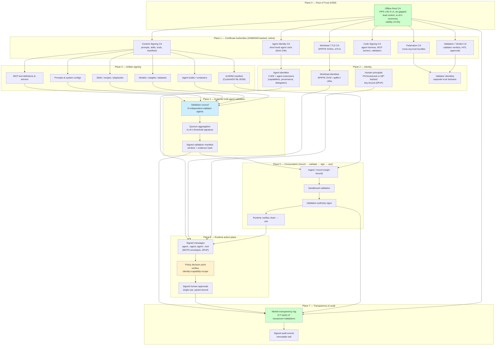
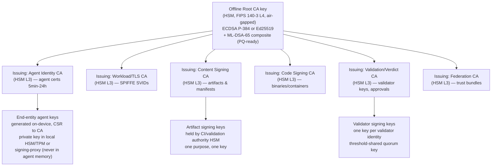
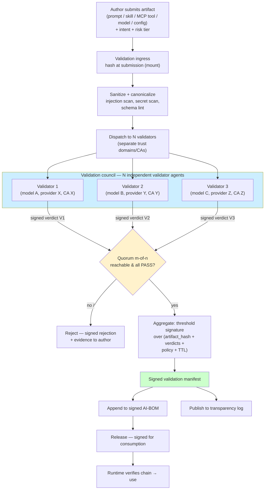
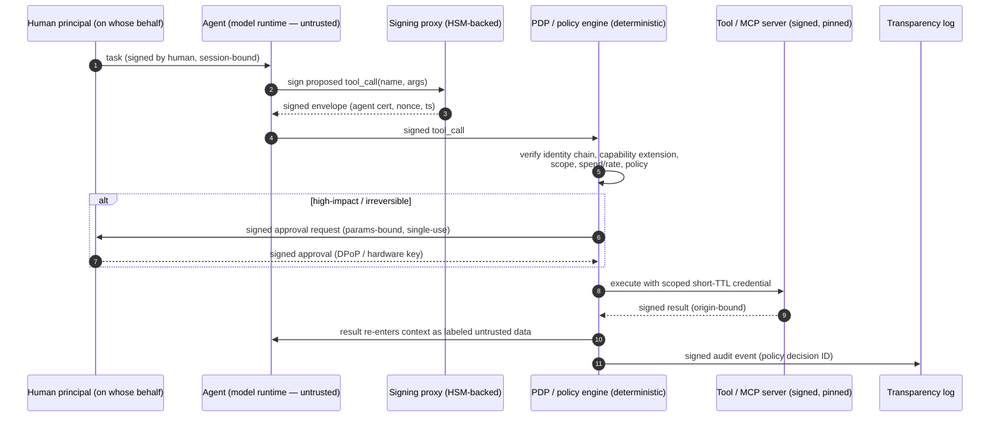
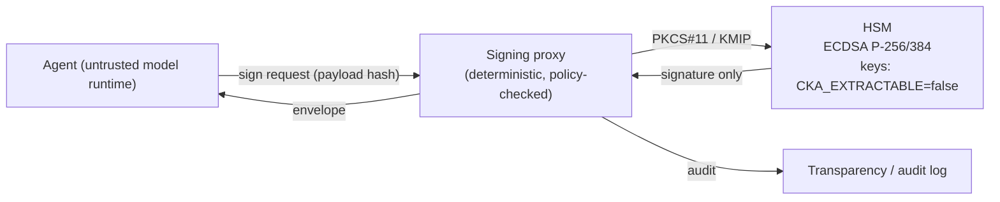

>**Design document — HSM-rooted validation, signing, and consumption chains for agents, prompts, skills, MCP tools, models, and runtime actions**

| | |
|---|---|
| Status | Draft v1 — research-backed design |
| Scope | AI agentic infrastructure: identity, artifacts (prompts, skills, MCP tools/servers), models/datasets, runtime messages, audit |
| Security posture | Zero trust (NIST SP 800-207) applied to the agent stack (OWASP LLM Top 10 2025 / MITRE ATLAS) |
| Trust anchor | FIPS 140-3 HSM-held root keys, offline root CA, online intermediate CAs |
| Companion doc | `GenAI-Security-Complete-Guide.md` ("the Guide") — this document is the cryptographic layer under its Parts III–IV controls |

---

## 0. Executive summary

An LLM agent is a **confused deputy by construction** and, since 2025, demonstrably **an untrusted principal with its own emergent incentives** (Guide, "core thesis"). Everything the model reads (web, email, documents, tool results, memory, tool *descriptions*) is inside the same context that holds instructions and privileges; and the model itself may act against policy. Security therefore cannot rest on "is this component trusted" — it must rest on **verifiable, tamper-evident chains of who-made-what, who-validated-what, and who-signed-what**, enforced at the point of every action.

This document designs a **Public Key Infrastructure (PKI) applied at every layer** of an AI agentic infrastructure:

1. **Root of trust** — an HSM-held, offline, dual-control CA hierarchy (the crypto anchor for everything below).
2. **Identity plane** — cryptographically verifiable identity for every agent, workload, validator, and human principal (SPIFFE/SPIRE mTLS + agent certificates with capability/provenance/delegation extensions).
3. **Artifact plane** — signed *content*: prompts, skills, MCP tool definitions and servers, models/weights, datasets, agent builds, manifests (AI-BOM). **Nothing enters an agent's context or runtime unsigned.**
4. **Validation plane** — an **external, multi-agent validation council**: before a new prompt, skill, MCP tool, model, or configuration is admitted, N independent validator agents (diverse models, separate trust domains, separate CAs) must each test it and sign a verdict; a quorum aggregate signature gates release. This is the "validation crypto/signature chain".
5. **Consumption plane** — **mount → validate → sign → use** at all levels, including user-supplied content: every artifact is ingested ("mounted") with provenance binding, validated in a sandbox, signed by the validation authority, and only then made usable; the runtime verifies the signature chain on every load and every call.
6. **Runtime plane** — signed agent→tool, agent→agent, and tool→agent messages (per-message signatures, replay protection, channel binding, proof-of-possession), plus signed human-in-the-loop (HITL) approvals.
7. **Transparency & audit** — append-only Merkle logs (CT-style) of all issuances and validations; signed audit events; tamper-evident, reconstructable trails.

All signing keys at every layer live in or are operationally confined by **HSMs** (FIPS 140-3 Level 3+; root at Level 4 / air-gapped). Private keys never reach agent memory, containers, or code. The chain of custody is: **HSM root → CA → artifact/agent credential → per-action signature → verified at point of use**, with every hop verifiable offline and auditable.

> Provenance ≠ safety. Signing proves **who** authored/validated an artifact, not that it is safe. Signing must be composed with the Guide's mediation, sandboxing, and M-class supervision controls (Parts III–V). The PKI makes those controls *enforceable and attributable*.

---

## 1. Objectives and requirements

| # | Requirement | Where addressed |
|---|---|---|
| R1 | Every agent/workload/validator has a unique, cryptographically verifiable identity; no ambient shared accounts | §4, §5 |
| R2 | No artifact (prompt, skill, tool, model, dataset, build) may be *used* without a valid signature chain to the HSM root | §6, §7 |
| R3 | Before admission, every new artifact is validated by **external multi-agent validation**; validation results themselves are signed and quorum-aggregated | §7, §8 |
| R4 | User-supplied content follows **mount → validate → sign → use**, at all levels (artifact, executable, message, model/data) | §9 |
| R5 | Every agent action is signed, replay-protected, and attributable (agent + acting human principal) | §10 |
| R6 | Validation/usage crypto runs on **HSM-backed keys**; software never holds long-lived private keys | §4, §11 |
| R7 | All issuance, validation, and action events are logged in tamper-evident, Merkle-anchored structures | §12 |
| R8 | Revocation is fast (sub-second where required), with short-lived credentials and cascade revocation | §13 |
| R9 | Trust is graduated, not binary: capability, provenance, and trust-tier constraints travel *inside* the credential | §5.3 |

---

## 2. Threat model and trust boundaries (from the Guide)

The Guide's Parts I and II define the attack surface this PKI must serve. The PKI controls map onto these threats:

| Threat (Guide ref) | PKI control |
|---|---|
| Tool description injection / tool poisoning (TPA) — §7 | Signed, pinned tool definitions covering name+description+schema (§6.4, MCPS §6) |
| Rug pull — tool changes after consent (§7) | Tool-hash pinning + re-approval → re-signing; hash change ⇒ quarantine (§6.5) |
| Cross-MCP tool confusion / tool squatting | Namespaced, origin-bound, signed tool registrations (§6.4, MCPS §4.4) |
| MCP server impersonation | Origin-bound agent passports + mutual TLS (mTLS) (§6.3, MCPS §4) |
| Prompt/skill tampering or injection at ingest | Signed content digests; signature verified at load (§7) |
| Model/weights supply chain (serialized-weight RCE, backdoors) — §10 | Signed model artifacts (safetensors + digest), SLSA provenance, backdoor evals gated by signature (§6.6) |
| Secret exfiltration via key theft from agent runtime (arXiv:2608.06130) | HSM-confined keys; signing proxies; no key material in agent memory (§11) |
| Agent identity spoofing / impersonation | Short-lived agent certificates, mTLS, trust-score decay (§5, §13) |
| Replay / line-jump / approval farming (HITL) | Per-message nonce+timestamp; single-use signed approvals; consume-once (§10, §9.5) |
| Insider/compromised CA / rogue issuance | Transparency logs (CT-style), multi-log consistency, HSM dual control (§8, §12) |
| Model-initiated misbehavior (M-class) — §6, II.19 | PKI can't stop the model *intending* harm, but it bounds *what the model can do*: every action is signed, scoped, mediated (§10), and revocable (§13) |
| Eval escape / reward hacking (M2/M3) — II.20 | Signed eval harness + signed answer keys in a separate trust domain; validator identity isolation (§8, §9.2) |

**Boundary statement (Guide §G1):** the model runtime, its context, and its outputs are **untrusted**. Trusted components are the deterministic enforcement plane: PDP, policy engine, signing/verification services, HSM, watchdog, and the transparency logs. Credentials (certificates, passports) are issued only to *deterministic* entities and to *validated* artifacts; the LLM itself never holds signing keys.

---

## 3. Design principles

1. **Never trust, always verify (and always *crypto-verify*).** Every load and every call verifies a signature chain to the HSM root. Verification is fail-closed: absent/expired/unknown signature ⇒ deny.
2. **Separation of duties.** Author ≠ validator ≠ signer ≠ releaser ≠ operator. No single entity (human or model) can both create and approve an artifact. (Guide G7.7, IV.2 RACI.)
3. **Provenance before trust.** Signature proves origin and integrity; trust *tier* is a policy decision layered on top (APKI trust-score pattern).
4. **Monotonic attenuation.** Delegation (human → orchestrator → sub-agent → tool) may only *narrow* capabilities, never widen (APKI §9.1).
5. **Short-lived by default.** Credentials live minutes–hours, not years; expiry is the primary revocation mechanism (APKI §1.2, §7.1).
6. **The HSM is the only long-lived secret.** All long-term key material resides in HSMs under dual control; everything else is ephemeral.
7. **Transparency over trust-in-CA.** Every issuance and validation is published to Merkle logs so mis-issuance is detectable even if a CA is compromised (§12).
8. **Diversity in validation.** Independent validators must differ in model, provider, trust domain, and CA so a single compromise cannot forge a passing verdict (§8).
9. **Fail closed, degrade signed.** Every denial and every policy decision is itself signed/audited so IR can distinguish "policy allowed" from "policy absent" (Guide G14.7).

---

## 4. Reference architecture overview

The PKI is organized in seven planes that overlay the Guide's eight-layer defense-in-depth (II.14). Every plane anchors to the HSM root.



---

## 5. Plane 0–1 — HSM root and CA hierarchy

### 5.1 Key hierarchy



**Rules**

- **MUST** operate the Root CA offline and air-gapped; root private key generation and certificate issuance happen during a witnessed **key ceremony** with m-of-n (e.g., 2-of-3 or 3-of-5) split custody and a documented ceremony script (FIPS 140-3 / Common Criteria EAL4+ HSM; NIST SP 800-57 key management practices).
- **MUST** use distinct keys per purpose (agent identity, TLS, content, code, validation, federation). Keys carry restrictive KeyUsage / ExtendedKeyUsage (e.g., content-signing keys: `digitalSignature`, no `keyEncipherment`, no `certSign` below the CA level).
- **SHOULD** deploy composite classical + post-quantum signatures (ECDSA P-256/384 + ML-DSA-65) for long-lived anchors and trust bundles; algorithm agility in protocol messages (APKI §11.3).
- **MUST** generate end-entity agent keys on the device/HSM and submit CSRs (RFC 2986) via an ACME-style flow (RFC 8555) with attestation evidence (APKI §7.1).
- **MUST NOT** ever export or backup private keys in plaintext; HSMs enforce non-exportability via `CKA_EXTRACTABLE = false`.

### 5.2 HSM selection and placement

| Tier | Requirement |
|---|---|
| Root | FIPS 140-3 Level 4 (or Level 3 in an air-gapped vault), e.g., nShield/Gemalto-class; m-of-n quorum cards; zero network interfaces |
| Intermediates | FIPS 140-3 Level 3 validated HSM or certified cloud KMS with FIPS boundary (AWS CloudHSM / Azure Managed HSM / GCP Cloud HSM), PKCS#11 or KMIP access |
| Agent local | TPM 2.0 or smartcard for low-assurance agents; remote signing proxy for all others (§11) |
| Federation | Same as intermediates; trust bundles published from HSM-signed metadata |

---

## 6. Plane 2 — Identity: who is talking

### 6.1 Workload identity — SPIFFE/SPIRE

- **MUST** issue every workload (agent runtime, validator, PDP, guardrail service, sandbox) an SPIFFE SVID (X.509-SVID, `spiffe://<trust-domain>/agent/<id>` in SAN) via SPIRE, renewed every 5–60 minutes, with mTLS on every internal hop.
- This gives *cryptographic* enforcement of the Guide's G13.1 ("each agent/service its own identity; never run-as-user ambiently").

### 6.2 Agent identity — X.509 + agent extensions (APKI pattern)

Layer the APKI extensions onto the identity CA's end-entity profile (adapting IETF draft-sharif-apki-agent-pki-00):

| Extension | Purpose | Enforced by |
|---|---|---|
| `agentTrustScore` (0–100, tiers, decay rate) | Graduated trust; decays without positive signals (soft revocation) | PDP minimum-tier checks |
| `agentCapabilities` (tool URIs, scope, spend/rate limits) | What the agent may touch | PDP + tool gateway + payment system |
| `agentDelegation` (parent cert hash, depth, monotonic attenuation) | Human → orchestrator → sub-agent chain; child ⊂ parent | CA at issuance; relying parties re-verify |
| `agentProvenance` (model family/version, framework, org, build hash) | Which model actually executes | Compliance + model-approval gates |
| `agentBehaviouralAttestation` (method: self/caVerified/third-party/hardware-bound) | How capabilities were verified | Regulated use cases |

- **MUST** keep agent certificates short-lived (default 1 h, range 5 min–24 h; APKI §3.1) — an agent is created, executes, and dies in milliseconds.
- **MUST** bind a human principal to every agent action: dual-attribute `(agent identity, acting human)` (Guide G13.4). Encode in the delegation extension (`humanPrincipal`) and in each signed message.

### 6.3 Origin binding (MCPS §4.4)

- Agent passports/certificates **MUST** be bound to an origin (`https://host:port`), and verifiers **MUST** reject passports presented at a different origin. This defeats server impersonation and certificate/credential reuse across domains.

### 6.4 Human identity

- Humans authenticate via IdP (OIDC/SAML) *plus* a key-bound proof-of-possession (DPoP, RFC 9449) or hardware token; HITL approvals are signed with the human's key (or a short-lived approval key issued to the approval session) — see §10.3.

---

## 7. Plane 3 — Artifact signing: nothing enters context unsigned

### 7.1 The artifact inventory (what gets signed)

Everything that can influence the model or execute on its behalf is an artifact with a canonical form, a digest, and a signature chain:

| Class | Examples | Canonical form / digest | Signer |
|---|---|---|---|
| Prompts & system configs | system prompt, guardrail configs, policy bundles | canonical text + SHA-256 | Content Signing CA via CI |
| Skills / recipes / playbooks | reusable agent procedures, few-shot templates | canonical markdown/JSON + digest | Content Signing CA |
| MCP tool definitions | `name`, `description`, `inputSchema` (full object incl. description!) | JCS (RFC 8785) + SHA-256 | Tool author (content CA) |
| MCP servers / code | server binaries, plugins, interpreters | binary digest (sigstore/cosign-style) | Code Signing CA |
| Models / weights / adapters | safetensors bundles, LoRA | digest of artifact + metadata | Model registry (content CA) |
| Datasets | fine-tune/eval corpora, RAG sources | corpus manifest + per-item digest | Content CA |
| Agent builds | container images, harness packages | OCI digest + SLSA provenance | Code Signing CA |
| AI-BOM | CycloneDX ML-BOM of all of the above | manifest + digest | Content Signing CA (post-approval) |

### 7.2 Signing rules

- **MUST** sign *canonical* serialization (JCS for JSON — RFC 8785) so different language runtimes produce identical bytes (MCPS §5.5).
- **MUST** cover the *whole* security-relevant object: for tools, `name + description + inputSchema`; a hash over schema alone misses description-injection (tool poisoning) (MCPS §6.3).
- **MUST** sign in CI on a hosted, hardened build platform (SLSA Build L2/L3), with provenance attesting *what* built *what* from *which inputs*; SLSA v1.0 levels are the maturity ladder.
- **MUST** pin tool hashes in a persistent store: on first use record `(server_origin, tool_name) → tool_hash`; on change ⇒ alert/reject per policy (rug-pull defense, Guide G7.2 + MCPS §6.4–6.5).
- **MUST** treat every artifact load (at runtime, per session) as a verification event: verify chain to root, freshness, and hash equality. Verification failure ⇒ deny + quarantine + alert.
- **MUST** refuse `.pickle`-class serialized weights; require `safetensors` or equivalent plus a signed digest (Guide §10; NIST IR 8336 model-signing recommendation).

### 7.3 Model & data supply chain

```mermaid
flowchart LR
    PUB["Model registry (provider)"] -->|"publish safetensors +<br/>signed digest + provenance"| REG["Internal model registry"]
    REG -->|"fetch + verify signature<br/>+ hash + license"| EVAL["Backdoor / safety eval<br/>(sandboxed, signed eval harness)"]
    EVAL -->|"signed eval verdict"| APPR["Approval (human + council quorum)"]
    APPR -->|"sign entry into AI-BOM"| BOM["Signed AI-BOM entry"]
    BOM -->|"runtime verifies chain<br/>before load"| RUN["Model runtime"]
    RUN -->|"every load re-verifies"| VER{"digest+signature<br/>valid & fresh?"}
    VER -->|"no"| Q["Quarantine + alert +<br/>disable model"]
    VER -->|"yes"| OK["Load (sandboxed)"]
```



---

## 8. Plane 4 — External multi-agent validation council

This is the **validation crypto/signature chain**: before any new prompt, skill, MCP tool, model, or configuration is admitted, an *external, multi-agent* body validates it, and each validator's verdict is cryptographically signed; admission requires a quorum aggregate signature over the validation manifest.

### 8.1 Why "external" and "multi-agent"

- **External**: validators run in trust domains separate from the author's pipeline and — for high-risk tiers — separate *organizations* with their own CAs and trust bundles (APKI §10 federation; NIST ZTA trust-agnostic). A compromised author pipeline cannot forge a passing verdict.
- **Multi-agent**: no single model/provider is trusted. Validators are diverse in model family, provider, temperature, framework, and identity. Diversity defeats correlated blind spots (one model's hallucination/alignment weakness is another's detector) and raises the cost of a coordinated attack.
- Validators are **deterministically supervised**: verdicts are structured JSON, evidence (eval reports, transcripts, hashes) is referenced, and the PDP audits validator behavior itself (Guide G6 / II.19 supervision applies to validators too).

### 8.2 Workflow



### 8.3 Verdict and manifest structure

```jsonc
{
  "validation_manifest_version": "1.0",
  "artifact": {
    "type": "mcp_tool_definition",          // prompt | skill | mcp_tool | mcp_server | model | dataset | config
    "digest_alg": "SHA-256",
    "digest": "…",
    "canonical_form": "jcs"                 // RFC 8785
  },
  "policy": { "risk_tier": "T3", "policy_hash": "…" },
  "validators": [
    {
      "validator_id": "agent://validator.org/b/…",
      "issuer_ca": "ca.validator-org-b.example",
      "model": {"family": "…", "version": "…"},
      "verdict": "PASS",
      "checks": [
        {"check": "description_injection", "result": "pass", "evidence_hash": "…"},
        {"check": "schema_strictness", "result": "pass", "evidence_hash": "…"},
        {"check": "exfil_primitive", "result": "pass", "evidence_hash": "…"}
      ],
      "signed_at": "…",
      "signature": "…"                      // ECDSA P-256/384, IEEE P1363, low-S
    }, /* … N entries … */
  ],
  "quorum": {"m": 2, "n": 3, "threshold_signature": "…"},
  "ttl": "…",                               // verdict freshness
  "released_by": "…",
  "validation_authority_signature": "…"     // HSM-backed, quorum key
}
```

### 8.4 Quorum and aggregation

- **MUST** require m-of-n distinct validator signatures (recommend: 3-of-5 for T3, 2-of-3 for T2, 1 independent for T1; tiers per Guide IV.18).
- Aggregate either as (a) **m-of-n threshold signature** (BLS or threshold ECDSA) with the quorum private key **inside the HSM**, so aggregation happens without ever assembling the full key, or (b) a **counter-signed manifest** with each validator's individual signature retained for audit. (a) is preferred for release gating; (b) is required for forensics.
- **MUST** bind the aggregate to the exact artifact digest, the policy version, and a TTL; a manifest that is stale, policy-drifted, or digest-mismatched must fail verification.
- **MUST** record every verdict, including rejects, in the transparency log; rejects are first-class evidence (Guide IV.9: every bypass becomes a regression test).

### 8.5 Validator identity and independence

- **MUST** issue each validator a distinct identity from a CA **not** controlled by the authoring pipeline; cross-org validators use federation trust bundles (APKI §10).
- **MUST** run validators in sandboxed eval harnesses with **no egress** and no access to answer keys or the author's secrets (Guide II.20 eval-integrity applies to the council).
- **MUST NOT** let any validator's model see another validator's verdict before committing its own (isolation defeats cascade conformity).
- **SHOULD** rotate validator identities/keys and re-attest validator software (code-signing CA) on a schedule; a validator whose runtime is unverifiable is treated as untrusted.

### 8.6 What "external" means operationally

For T3 artifacts, at least one validator SHOULD be a third party (different legal entity) whose trust bundle is exchanged out-of-band (APKI §10.1); for T2/T1, "external" means outside the author's process/tenant (separate SPIRE trust domain) with a distinct CA. In all cases the trust anchor for validation is the **Federation/Validation CA**, not the author's pipeline.

---

## 9. Plane 5 — Consumption: mount → validate → sign → use, at all levels

The user's required pattern — **mount (validation) → sign → usage** — is applied recursively at every level of the stack. "Mount" = ingest with binding and provenance capture; "validate" = deterministic + multi-agent checks in a sandbox; "sign" = validation authority attests the exact bytes validated; "use" = runtime consumes only signed, fresh, hash-matching artifacts.

### 9.1 The generic pipeline

```mermaid
flowchart LR
    subgraph MOUNT["① Mount"]
        M1["Bind source identity<br/>(user / author / repo / org)"]
        M2["Hash at ingest —<br/>immutable record"]
        M3["Classify data &<br/>risk tier"]
    end
    subgraph VALIDATE["② Validate"]
        V1["Sanitize + normalize<br/>(injection/secret/schema scan)"]
        V2["Sandboxed execution tests<br/>(if executable)"]
        V3["External multi-agent<br/>validation council (m-of-n)"]
    end
    subgraph SIGN["③ Sign"]
        S1["Validation authority signs<br/>attestation: digest + verdicts +<br/>principal + policy + TTL"]
        S2["Publish to Merkle log"]
    end
    subgraph USE["④ Use"]
        U1["Runtime verifies chain<br/>(root→CA→artifact)"]
        U2["Hash match + freshness +<br/>capability check"]
        U3["Use under PDP policy<br/>+ per-action signatures"]
    end
    MOUNT --> VALIDATE --> SIGN --> USE
    USE -.->|"change detected ⇒<br/>re-mount (re-validate)"| MOUNT
```



### 9.2 Applied at each level

| Level | Mount | Validate | Sign | Use |
|---|---|---|---|---|
| **L-a. Static artifacts** (prompts, skills, configs) | Ingest with author identity + hash | Injection suite, secret scan, policy lint, council | Content CA signs manifest (digest-bound) | Loader verifies chain; context assembled from signed blobs only |
| **L-b. Executable code** (MCP servers, plugins, harness) | Build on hosted platform; record inputs | SAST/DAST/SCA, container scan, sandbox execution, council | Code Signing CA + SLSA provenance (cosign-style) | Execution gate verifies signature; sandbox runs with least privilege (Guide G11) |
| **L-c. Runtime messages** (tool calls, results, agent↔agent) | Session/context binding + origin | PDP schema/impact/policy checks | Per-message signatures (MCPS envelopes, DPoP) | Recipient verifies per-message sig + replay window before acting (§10) |
| **L-d. Model & data** (weights, datasets, RAG corpus) | Registry-bound ingest, per-item hash | Backdoor/poisoning eval, provenance check, council | Model registry signs digest + AI-BOM entry | Runtime verifies before load; retrieval only from signed corpus (§7.3) |
| **L-e. User-supplied content** (custom prompts, uploads, mounts) | Bind user principal + source channel | Full validation pipeline (§9.3) | Attestation signed for the *validated* bytes | Use permitted only under the signed attestation; mutation ⇒ re-validation |

### 9.3 User-supplied content ("user testing mount")

Users may supply prompts, skills, tool configs, datasets, or filesystem/volume mounts. Zero trust means *their* content is as untrusted as an attacker's — the pipeline is identical, with an extra attribution step:

1. **Mount**: bind the content to the user's verified identity and the exact channel (upload session, volume claim, git ref). Record the digest and the user's signature (proof of submission) at ingest. A "mount" is not usable until the signed attestation exists.
2. **Validate**: the same sanitize → sandbox → council pipeline, plus user-context checks (tenant isolation, data classification, per-user capability scope).
3. **Sign**: the validation authority signs an attestation binding `content_digest + validation_manifest + user_principal + session + TTL`. The signature never covers bytes other than those validated.
4. **Use**: the runtime only loads content whose attestation verifies to the HSM root and matches the mounted bytes. Any modification — even a single byte — breaks the chain; the content is quarantined and a re-mount is required. Every use is itself a signed action attributable to the user on whose behalf the agent acts (dual attribution, Guide G13.4).

This is the **"user testing mount → validation → sign → usage"** contract: *usage is the signed consequence of validation, and validation is the signed precondition of usage* — at every level.

---

## 10. Plane 6 — Runtime action plane: signed everything

### 10.1 Per-message signing (MCPS pattern)

Every JSON-RPC message between agent and tool, and between agents, is wrapped in a signed envelope:

```
{ "mcps": { "version", "passport_id", "timestamp", "nonce", "signature" },
  "jsonrpc": "2.0", "method", "params", "id" }
```

- **MUST** sign over `SHA-256(JCS(message))` with ECDSA P-256/384 (deterministic RFC 6979, IEEE P1363 r‖s, **low-S normalization** to defeat signature malleability), per draft-sharif-mcps-secure-mcp.
- **MUST** include a nonce (16 random bytes) + timestamp window (default 5 min); the nonce store keys on the **nonce string**, not message bytes.
- **MUST** negotiate trust levels (L0–L4) and bind the transcript to prevent downgrade (`transcript binding`, MCPS §9.5).
- **SHOULD** add TLS channel binding (RFC 9266 `tls-exporter`) to bind signatures to the session.

### 10.2 Action authorization chain



- The **model never holds the signing key**; it requests signatures from a deterministic signing proxy bound to the HSM (per arXiv:2608.06130, this converts 19.3% injection-driven key compromise ASR to ~0% in their evaluation).
- HITL approvals are **single-use, parameter-bound (exact args hash), time-boxed, and signed**; line-jump and post-approval tampering break the signature or the consume-once record (Guide G10, II.13).
- Tool results are signed and re-entered as **labeled untrusted data** with provenance (Guide G5.3, II.16).

### 10.3 Credential presentation per hop (Guide G13.5)

Each hop (agent→proxy→PDP→tool) presents a short-lived credential for that hop only; no hop can reuse another hop's credential. Bearer tokens, where used, are DPoP-bound to the same key as the MCPS passport (unified identity).

---

## 11. HSM integration: the signing proxy and key confinement

The single most important operational control: **private keys are never in agent memory** (arXiv:2608.06130).



**Design rules**

- **MUST** expose signing to agents exclusively through a **signing proxy** that (1) validates the request is from a verified agent identity, (2) enforces rate limits, (3) signs only canonical payloads, (4) never returns key material.
- **MUST** generate all long-lived keys inside the HSM (`CKA_EXTRACTABLE = false`, `CKA_SENSITIVE = true`); restrict allowed mechanisms per key to `CKM_ECDSA`/`CKM_EDDSA` sign/verify.
- **MUST** implement **dual control** for root and CA-key operations (n-of-m authentication, split custody), with an HSM audit log of every key event.
- **SHOULD** use per-agent ephemeral keys generated on a local TPM/smartcard for low-assurance agents; the signing proxy for everything else.
- **MUST** rotate intermediate CAs on a schedule and on suspicion (Guide G12.4); the root's only job is to re-issue intermediates.
- **MUST** keep HSM firmware/patches current and test key-ceremony runbooks annually (Guide IV.17 kill-switch/key drills).
- **SHOULD** plan post-quantum migration: composite signatures (classical + ML-DSA/SLH-DSA) in the hierarchy, per NIST transition guidance and APKI §11.3.

---

## 12. Plane 7 — Transparency and audit

- **MUST** run CT-style **append-only Merkle transparency logs** for: every agent certificate issuance (Agent Transparency Log, APKI §8), every validation manifest/verdict, and every AI-BOM mutation. Logs **MUST** be operated independently of the CAs (multiple logs, cross-log consistency via gossip) so mis-issuance is *detectable* even when a CA or signer is compromised.
- **MUST** return a **Signed Agent Timestamp / Signed Manifest Timestamp** (RFC 9162 model) for every submitted entry; clients reject entries lacking a valid log inclusion proof.
- **MUST** sign every audit event (policy decision ID, approval, denial, revocation, load, mount) with an HSM-backed audit key, giving non-repudiation and reconstructability *from the trail alone* (Guide G14.2).
- **MUST** redact secrets/PII at write time (Guide G14.3) while preserving hashes and provenance.
- **SHOULD** alert on: unexpected issuance in a trust domain, bulk registrations, manifest digests re-signed without new validation, revoked certificates still presented, validator identity churn.

---

## 13. Revocation and lifecycle

| Mechanism | Use | Latency |
|---|---|---|
| **Natural expiry** (short-lived certs, 5 min–24 h) | Primary; a compromised credential self-destructs | Immediate |
| **Trust decay** (APKI §6.2) | Soft revocation: idle/misbehaving agents lose tier | Continuous |
| **CRL** (60 s refresh) + **OCSP** (sub-second, stapled) | Explicit revocation, fail-closed when unreachable | < 1 s |
| **Cascade revocation** (APKI §9.3) | Revoking a parent revokes the whole delegation subtree | < 1 s to OCSP |
| **Verdict/manifest TTL** | Validation results expire; re-validation required | Policy-bound |
| **Key rotation / compromise recovery** (MCPS §4.5) | `previous_key_hash` chain on rotation; revoke old passports | On demand |

- **MUST** fail closed: if OCSP/CRL or the transparency log is unreachable during high-assurance operations, deny rather than allow (MCPS §8.9, APKI §11.5).
- **MUST** tie revocation to the Guide's incident path (II.18): revoke agent/tool credentials, disable tools, freeze memory writes — each revocation is itself a signed, logged event.

---

## 14. Gate integration with the Guide's lifecycle (Part IV)

| Guide gate | PKI requirement added |
|---|---|
| Gate 0 Governance | PKI policy, key ceremony, HSM procurement, trust-bundle federation agreements, validator roster approved |
| Gate 3 Threat model | Signing/verification flow diagram; key-confinement review; validator-independence review |
| Gate 4 Design | CA hierarchy + certificate profiles + AI-BOM signing design; MCPS trust levels chosen per tier |
| Gate 5 Implementation | CI signs artifacts; SAST/SCA; HSM integration tests; signing-proxy unit/injection tests |
| Gate 6 Verification | Red-team PKI abuse: forged manifests, replay, downgrade, validator collusion, HSM misuse; regression corpus includes PKI attacks |
| Gate 7 Release | Canary verifies: signatures verified in prod, revocation reachable, kill-switch tested |
| Gate 8 Operations | Transparency-log monitoring, trust-score decay review, PKI metrics (issuance rate, revocation latency, verification failure rate) |
| Gate 9 Change | Any artifact/autonomy change ⇒ re-validation + re-signing + new AI-BOM entry (Guide IV.12) |
| Gate 10 Incident | Key/cert revocation verified; transparency-log replay; validator compromise handling |
| Gate 11 Decommission | Revoke all agent/validator/artifact credentials; archive logs per retention; disposition documented |

**Risk-tier tailoring** (Guide IV.18): T0 — single CA, self-signed passports capped at L0; T1 — signed artifacts, 1 validator; T2 — 2-of-3 council, SPIFFE mTLS, tool signing; T3 — full hierarchy, 3-of-5 council with ≥1 external org, hardware-bound attestation, composite PQ signatures.

---

## 15. Threat → control traceability (PKI-specific)

| Attack (Guide Part I) | PKI control that stops/bounds it |
|---|---|
| Tool description injection (TPA) | Signed full tool object + pinning; description changes break hash (MCPS §6) |
| Rug pull | Pinned tool hash; re-approval → re-signing; hash change ⇒ quarantine |
| MCP server impersonation | Origin-bound passports + mTLS (SPIFFE) + trust-level negotiation |
| Prompt/system-prompt tampering | Signed content digest verified at load; prompts assembled only from signed blobs |
| Model serialization RCE / backdoor | Signed safetensors + provenance + sandboxed backdoor eval before AI-BOM admission |
| Exfiltration via keys in context/memory | Keys never in runtime; HSM signing proxy; canaries |
| Replay / line-jump / approval farming | Nonce+timestamp, consume-once signed approvals, transcript binding |
| Cross-tenant leakage | Per-tenant signing/verification domains; tenant-bound attestations |
| Rogue issuance / compromised CA | Transparency logs + multi-log consistency + HSM dual control + short-lived intermediates |
| Validator collusion / single-model bias | m-of-n diversity (model, provider, org, CA) + validator supervision + verdict isolation |
| Eval escape / reward hacking | Signed eval harness, signed answer keys in separate trust domain, validator isolation (II.20) |
| Insider CA operator | Dual control, m-of-n ceremony, log monitoring, separation of duties |
| Quantum harvest-now-decrypt-later | Composite classical + ML-DSA signatures on anchors/bundles |

---

## 16. Implementation roadmap

| Phase  | Deliverables                                                                                                   | Exit criteria                                                                 |
| ------ | -------------------------------------------------------------------------------------------------------------- | ----------------------------------------------------------------------------- |
| **P0** | Key ceremony; Root CA + intermediates in HSM; SPIFFE/SPIRE; agent cert profile; signing proxy v1               | Certificates verify to root; agents get short-lived IDs; keys never leave HSM |
| **P1** | Artifact signing pipeline in CI; tool-definition signing (MCPS layer); pin store; AI-BOM signing               | All artifacts signed; load-time verification fail-closed                      |
| **P2** | Validation council: validator identities, isolated harness, verdict schema, quorum aggregation (HSM threshold) | m-of-n gating enforced; rejects logged; 0 validations without signature       |
| **P3** | mount→validate→sign→use for user content; runtime message signing + DPoP; HITL signed approvals                | Full plane 5/6 chain live on T1 workload                                      |
| **P4** | Transparency logs + monitoring; cascade revocation; T2/T3 rollout; PQ composite anchors                        | Gate 6 PKI red-team pass; kill-switch + revocation drills < 1 s               |

**Guardrails:** every phase ends with a Guide-gate review; PKI changes are themselves change-managed (Gate 9); validator roster and trust bundles are reviewed quarterly.

---

## 17. References

### Standards & frameworks
1. NIST SP 800-207, *Zero Trust Architecture*, Aug 2020. https://csrc.nist.gov/pubs/sp/800/207/final
2. NIST IR 8336, *Deploying AI Systems Securely: Requirements, Challenges, and Best Practices*, Jul 2024 (signed-model and AI supply-chain guidance). https://csrc.nist.gov/pubs/ir/8336/final
3. NIST AI 100-2e, *Adversarial Machine Learning: A Taxonomy and Terminology of Attacks and Mitigations*, Jan 2024 (signed model, provenance mitigations). https://csrc.nist.gov/pubs/ai/100/2e/final
4. NIST FIPS 186-5 *Digital Signature Standard*; SP 800-57 *Key Management*; SP 800-90 series *Random Bit Generation*; FIPS 140-3 *Security Requirements for Cryptographic Modules*. https://csrc.nist.gov/pubs
5. SLSA (Supply-chain Levels for Software Artifacts) v1.0, *Security levels* (Build L0–L3). https://slsa.dev/spec/v1.0/levels
6. IETF: RFC 5280 (X.509/PKIX), RFC 8555 (ACME), RFC 9162 (CT v2), RFC 6962 (CT v1), RFC 8785 (JCS), RFC 9449 (DPoP), RFC 9334 (RATS), RFC 9421 (HTTP Message Signatures), RFC 2986 (PKCS#10).
7. IETF WIMSE WG — *Workload Identity in Multi-System Environments* (draft-ietf-wimse-arch).
8. SPIFFE/SPIRE — *Secure Production Identity Framework for Everyone*. https://spiffe.io
9. W3C — *Decentralized Identifiers (DIDs) v1.0*; *Verifiable Credentials Data Model v1.1*.
10. OWASP — *Top 10 for LLM Applications 2025*; *GenAI/Agentic security guidance*. https://owasp.org/www-project-top-10-for-large-language-model-applications/
11. Model Context Protocol (MCP) specification and security best practices (Anthropic). https://modelcontextprotocol.io
12. CISA — *Zero Trust Maturity Model* v2. https://www.cisa.gov/zero-trust-maturity-model
13. EU AI Act (2024/1689); ISO/IEC 42001 *AI management systems*.

### Papers & drafts with the same or similar ideas
14. Huang, K., Narajala, V.S., Yeoh, J., Ross, J., Raskar, R., et al., *A Novel Zero-Trust Identity Framework for Agentic AI: Decentralized Authentication and Fine-Grained Access Control*, arXiv:2505.19301 (May 2025). — DID/VC-based agent identity, Agent Naming Service, ZKP attribute disclosure.
15. Sharif, R., *Agent Public Key Infrastructure (APKI): Certificate-Based Identity and Trust for Autonomous AI Agents*, IETF draft-sharif-apki-agent-pki-00 (Apr 2026, work in progress). — X.509v3 agent extensions (trust score, capabilities, delegation with monotonic attenuation, provenance, behavioural attestation), HSM-protected root, Agent Transparency Logs, short-lived certs, cascade revocation. *(The closest prior art for the certificate profile in §5–§6.)*
16. Sharif, R., *MCPS: Cryptographic Security Layer for the Model Context Protocol*, IETF draft-sharif-mcps-secure-mcp-00 (Mar 2026, work in progress). — Agent Passports, per-message signing, tool-definition signing, replay protection, L0–L4 trust levels, transcript binding. *(Closest prior art for §6.3–§6.5 and §10.1.)*
17. Sambrook, L., Sovio, S., *Hardware Keystores for AI Agent Signing Workflows: A Zero-Trust MCP Enforcement Architecture*, arXiv:2608.06130 (Aug 2026). — HSM/PKCS#11 key confinement for agent signing, five-layer zero-trust enforcement; ASR 19.3% → 0% across four LLMs (n=192) on AgentDojo-style injection. *(Direct evidence for §11.)*
18. Jamshidi, S., Nafi, K.W., Moradi Dakhel, A., Khomh, F., Hamdaqa, M., *Verifiable Manifest Signing and Transparency Enforcement for Secure MCP-Based LLM Pipelines*, arXiv:2601.23132 (Jan 2026). — Manifest-level signing + Merkle transparency for MCP; replay/stale/policy-violation rejection >98.7%.
19. Maiti, S., *Caging the Agents: A Zero Trust Security Architecture for Autonomous AI in Healthcare*, arXiv:2603.17419 (Mar 2026). — Four-layer ZT defense for production agents: gVisor isolation, credential proxy sidecars, egress policies, prompt-integrity framework.
20. Zhou, X., Ustiugov, D., et al., *MemTrust: A Zero-Trust Architecture for Unified AI Memory System*, arXiv:2601.07004 (Jan 2026). — TEE-backed zero-trust for AI memory/context layers.
21. Singh, A., et al., *Evolution of AI Agent Registry Solutions: Centralized, Enterprise, and Distributed Approaches*, arXiv:2508.03095 (2025); Wang, S., Raskar, R., et al., *Using the NANDA Index Architecture in Practice*, arXiv:2508.03101 (2025). — Agent registries (MCP Registry, A2A Agent Cards, AGNTCY with Sigstore-backed integrity, Microsoft Entra Agent ID), Zero-Trust Agentic Access (ZTAA).
22. Lan, Q., Kaul, A., et al., *Zero-Trust Runtime Verification for Agentic Payment Protocols: Mitigating Replay and Context-Binding Failures in AP2*, arXiv:2602.06345 (Feb 2026). — Consume-once mandates, context binding, nonce-based runtime enforcement.
23. Debenedetti, E., et al., *AgentDojo: A Dynamic Environment to Evaluate Prompt Injection Attacks and Defenses*, arXiv:2406.13352 (2024). — The benchmark underlying ref. 17's evaluation.
24. The Guide's own reference: *governed escalation channels reduce agentic misalignment*, arXiv:2510.05192 (Oct 2025) — cited by the GenAI-Security-Complete-Guide §II.11.

### Primary source consulted
25. `GenAI-Security-Complete-Guide.md` — threat landscape, defense-in-depth reference architecture (II.14), tool mediation (II.16), supervision (II.19), eval-integrity (II.20), secure development guideline G5/G7/G12/G13/G14, and lifecycle gates (Part IV). All §2/§3/§14 mappings refer to it.

---

*Note: IETF drafts (15, 16) are work in progress and not standards; the design adopts their patterns as prior art. Statistical claims (97M MCP SDK downloads, 13k servers, 16% enterprises issuing agent certificates, 41% unauthenticated MCP servers) originate in drafts 15/16 and should be re-verified before external publication.*
