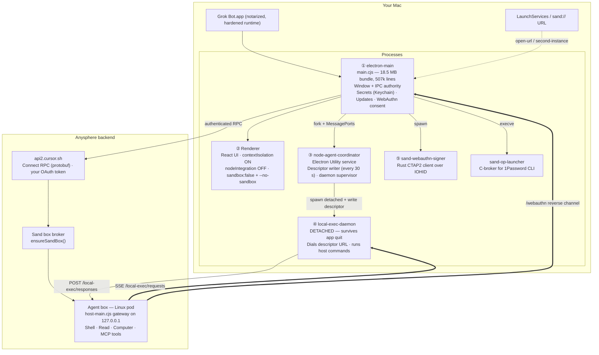
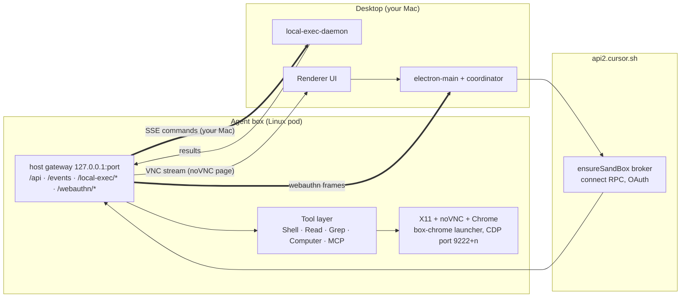
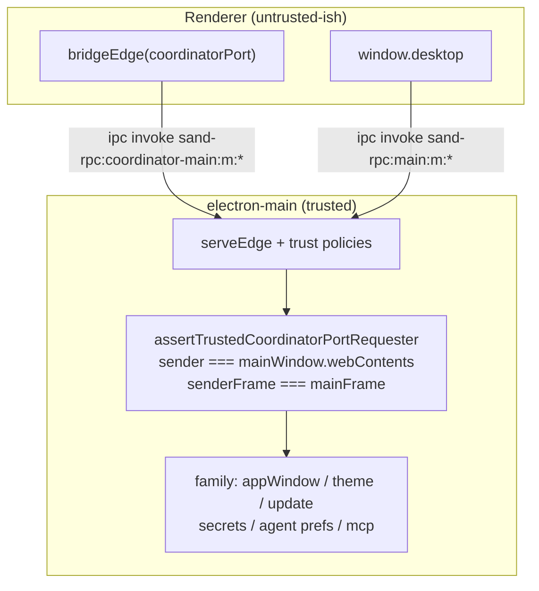
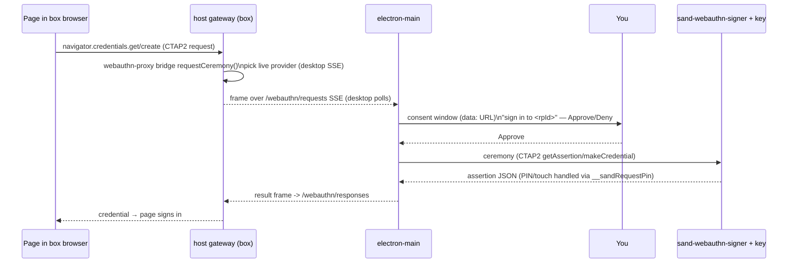
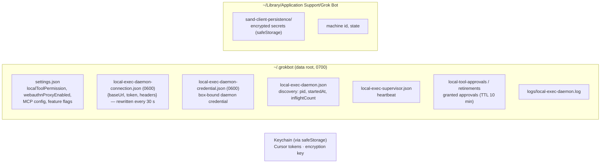
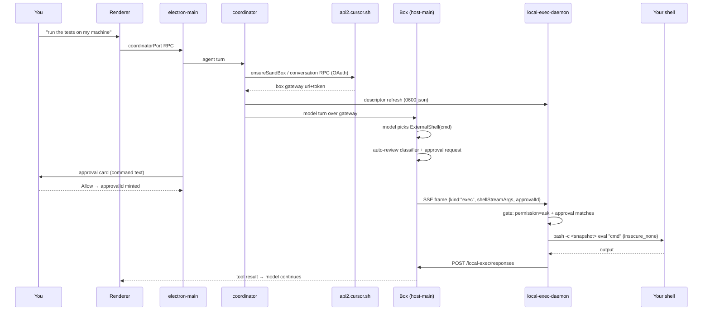

# How Grok Bot 0.18.0 Works

**An architecture and mechanics walkthrough of `Grok Bot.app` (`com.anysphere.sand`, v0.18.0, Electron 42.1.0 / Chromium ~140, macOS arm64)**

Everything in this document was verified against the shipped bundle: the `app.asar` (SHA-256 `31f1586a…`, pinned by `ElectronAsarIntegrity`), its unpacked native helpers, and Ghidra decompilation of those helpers. File references point into the extracted bundle layout (`dist/…`). This is a *mechanics* document — for the security view of the same system, see `triage-report.md`.

---

## 1. What the product is

Grok Bot (internal name **"sand"**) is an **agentic desktop application**: a chat window in which an AI agent works on your behalf. The defining design decision is that the agent does *not* run on your Mac — it runs in a remote Linux container called the **box** — while the desktop app acts as the agent's *hands* on your actual computer when you allow it.

Concretely, one installation gives you:

- a **UI** (React/Electron window) for conversations, agent management, and approvals;
- a **remote agent runtime** ("box") — either a brokered cloud pod (default, via Anysphere's backend) or a local Docker container in dev mode — where the model's tools (`Shell`, `Read`, `Computer`, MCP…) actually execute;
- a **reverse tool channel** by which the box can, with your approval, run commands on *your* Mac (`ExternalShell`, `ExternalRead`, `AwaitExternalShell`);
- a set of **desktop-bridged capabilities**: your hardware security key (proxied WebAuthn), your clipboard (mirrored into a VNC view of the box desktop), your browser (opened pages), and your secrets store;
- an **update service** and telemetry, both phoning home to `api2.cursor.sh`.

The tension that shapes the whole architecture is visible immediately: the same channel that legitimately lets the agent run `git status` on your machine is, from the OS's point of view, indistinguishable from malware. Most of the engineering described below exists to make that channel *permissioned* and *observable*.

---

## 2. Process architecture

The `.app` bundle spawns **five cooperating processes** on your Mac, plus the remote box.

### ① `electron-main` — the authority

`dist/electron-main/main.cjs` is the trusted core. It owns the `BrowserWindow`, every `ipcMain` handler, the secrets stores, the update service, the WebAuthn consent dialogs, and the spawning of everything else. Startup order (from `main.cjs:505860+` and `506179+`):

1. Read stamped `package.json` → set `SAND_LAB`, `SAND_CLIENT_APP_VERSION` env for children.
2. `bootstrapDesktopUserData()` / `bootstrapDesktopDataRoot()` — locate `~/.grokbot` (production data root; `.cursor/sand` legacy).
3. Single-instance lock (`app.requestSingleInstanceLock()`); a second launch forwards its argv as deep-link candidates to the first instance and quits.
4. Chromium switches: `--no-sandbox`, `--disable-gpu`, hardware acceleration off.
5. Create the main window: `contextIsolation: true`, `nodeIntegration: false`, `sandbox: false`, `webviewTag: true`, preload = `preload.cjs`; load `dist/renderer/index.html` from disk (or `VITE_DEV_SERVER_URL` in dev).
6. Wire the **edges** (typed RPC surfaces, see §4), the coordinator fork, the MCP runtime, telemetry (Sentry, Statsig, OTel), and the update service.

### ② Renderer — the UI

A React app talking to main exclusively through the `contextBridge`-exposed `window.desktop` and `window.coordinatorPort` objects (`preload.cjs:803-804`). The bridge surface is deliberately narrow: window controls, theme, update status, agent preferences, secrets CRUD, and the coordinator MessagePort. Every sensitive IPC family re-checks on the main side that the sender is *the main window's top frame* (`createTrustedSenderGuards`, `main.cjs:500657`).

### ③ Coordinator — the broker's client

`dist/node-agent-coordinator/main.cjs` runs as an Electron Utility process (forked via `child_process.fork` with `serviceName: "sand-node-agent-coordinator"`), handed three `MessagePort`s at bootstrap (`coordinator-launcher.ts`, `main.cjs:494531-494580`). Its job is to be the always-on intermediary to the backend:

- **`ensureSandBox()`** — the RPC that provisions/locates your box. The response carries everything the desktop needs to talk to it: `gatewayUrl`, `gatewayToken`, `networkToken`, `vncUrl`, `forkVncBaseUrl`, `terminalsFolder` (`EnsureSandBoxResponse` proto, `main.cjs:489264+`).
- **Descriptor maintenance** — every 30 s (`LOCAL_EXEC_DAEMON_REFRESH_INTERVAL_MS`) it calls `resolveGatewayConnection` and atomically rewrites `~/.grokbot/local-exec-daemon-connection.json` (mode 0600) so the daemon always knows the live box (`supervisor.ts`, `node-agent-coordinator/main.cjs:2901-2960`).
- **Daemon supervision** — reads `local-exec-daemon.json` (discovery: pid/startedAt/inflightCount) and decides `spawn | adopt | replace`; respawns up to 10 times.
- **Credential handoff** — once per session it asks main to `mintLocalExecDaemonCredential()` (POST `/sand-box/local-exec-daemon-credential` with your access token) and parks the result in `local-exec-daemon-credential.json` (0600) so the daemon can self-heal a stale connection with no desktop running.

### ④ The local-exec daemon — the hands on your Mac

`dist/local-exec-daemon/main.cjs` is spawned **detached** (`spawnLocalExecDaemon`, `main.cjs:493882-493924`), logging to `~/.grokbot/logs/`, and is deliberately built to outlive the app. It implements a *pull* model:

1. Read the connection descriptor `{baseUrl, token?, headers?}`.
2. `GET {baseUrl}/local-exec/requests` with `Accept: text/event-stream` → an SSE stream of frames.
3. Dispatch frames (`handleRequest`, `local-exec-daemon/main.cjs:254629`):
   - `welcome` — adopt a providerId;
   - `exec` — a protobuf `ExecServerMessage` whose `message.case` selects the executor: `shellStreamArgs`, `backgroundShellSpawnArgs`, `writeShellStdinArgs`, `forceBackgroundShellArgs`, `readArgs`, `lsArgs`, …;
   - `upload` / `download` — base64 file transfer, root-confined by `containPath()` (lexical + realpath symlink checks against the local-exec root, default `$HOME`);
   - `cancel`, `retire-approval`.
4. `POST {baseUrl}/local-exec/responses` with result frames (retries ×3, then drops).

Before an `exec` runs, the **approval gate** (`isLocalUseBlocked`, `local-exec-daemon/main.cjs:254962`) consults `settings.json` → `localToolPermission`:

- `"never"` → refuse everything (`ExternalShell` family disabled);
- `"always"` → run without prompting;
- `"ask"` (default) → require an approval ID minted by the desktop when you clicked Allow, matched against `local-tool-approvals.json` (TTL 10 min, exact action+target match, with a special case: a `run-command` approval also covers reading files in that command's `terminals/` output folder).

Shell execution is *stateful*: a snapshot of your login shell (cwd, exports, options, functions, aliases) is captured once by running `bash -ilc dump_bash_state` (or the zsh equivalent), then replayed around each command (`bash.js`, `local-exec-daemon/main.cjs:103180-103420`), so consecutive `ExternalShell` calls behave like one terminal session. Sandbox policy for these commands comes from the tool call; in this build the `ExternalShell` path ships no policy, so commands run `insecure_none` (unsandboxed) — see `triage-report.md` F2.

### ⑤ Native helpers

- **`sand-webauthn-signer`** (4.5 MB, Rust): a full CTAP2 client. Imports only IOKit/IOHID, CoreFoundation and libc — it speaks USB/HID to your security key and nothing else. The desktop drives it during proxied passkey ceremonies.
- **`sand-op-launcher`** (136 KB, C, both archs): a *broker* for the 1Password CLI. Ghidra decompilation of `main` shows its contract: `realpath` the `op` binary, open it `O_EVTONLY`, verify `SecStaticCodeCheckValidity` against `identifier "com.1password.op" and anchor apple generic and certificate leaf[subject.OU] = "2BUA8C4S2C"`, re-`fstat` and compare dev/ino/size/mtime/ctime (closing the TOCTOU window), apply a `sandbox_init_with_parameters` profile that denies reads of `~/Library/Group Containers/2BUA8C4S2C.com.1password`, scrub all `OP_*` env vars, then `execve` — and only for four allowlisted invocation shapes (`--version`, `account list`, `vault list --account <id> --format=json`, `vault create`, `service-account create … :read_items … --raw`). It exists so the agent can mint narrowly-scoped 1Password service-account tokens without ever being able to read your vault data.

---

## 3. The box — where the agent actually runs

The box is a Linux environment (brokered pod by default; `public.ecr.aws/k0i0n2g5/cursorenvironments/universal:sand-box-latest` in dev/cloud-VM flows). Inside it runs **`host-main.cjs`** — the same bundle's "host" build — which provides:

- an **HTTP gateway on 127.0.0.1** (in-box) exposing `/health`, `/events` (SSE), `/api/<method>` (the agent-command RPC table), `/local-exec/requests|responses`, `/webauthn/requests|responses`, and `/avatars/…`;
- the **agent tool implementations**: shell streams, background shells, reads, greps (ripgrep), git diffs, MCP calls, computer-use, canvas diagnostics, conversation search, web fetch/search, hooks;
- the **auto-review classifier** plumbing that decides autonomously-run vs. ask-the-user;
- a desktop (X11 + noVNC + Chrome) for the `Computer` tool, reachable over `vncUrl` with an `x-anyrun-network-token` header.

The desktop never talks to the box directly for commands — it goes through the backend-brokered gateway connection. The **reverse** direction (box → your Mac) is the local-exec channel of §2.④.

---

## 4. The RPC "edge" system

All inter-process calls inside the desktop use one uniform pattern, `serveEdge` / `bridgeEdge` (`dune/src/internal/rpc/edge.ts`, visible in `main.cjs:494590+` and every preload):

- each surface declares a **contract** (edge name + events) and a **method table** with per-method **trust labels**;
- the transport is Electron IPC channels named `sand-rpc:<edge>:m:<method>` and `…:e:<event>`;
- on the main side, a trust **policy map** decides per-method whether the sender is allowed (e.g. `assertTrustedCoordinatorPortRequester` requires sender == main window top frame);
- replies are enveloped `{ok:true,value}` / `{ok:false,failure:{code,detail}}` so renderer exceptions cross the bridge as typed errors.

Edges found in the build: `main` (the whole `window.desktop` surface), `coordinator-main`, `coordinator-port` (MessagePort handoff), `box-vnc` (clipboard/user-presence, restricted to the box-desktop webview partition *and* a registered origin), plus dev-only edges behind `!isPackaged`.

---

## 5. Deep links — how a web page wakes the app

`Info.plist` registers the **`sand://`** scheme (plus `https://cursor.com/sand/link/*`). `parseSandDeepLink` (`main.cjs:485294-485420`) accepts exactly three routes, and nothing else survives parsing:

| Route | Canonical form | Effect |
|---|---|---|
| plugin-add | `sand://app/v1/plugin/add?id=<1–19 digits>` | Renderer offers to install marketplace plugin `id` |
| open | `sand://app/v1/open` | Focus/open the main window |
| info | `sand://app/v1/info?topic=deep-links` | Open the deep-links help topic |

The grammar is intentionally tight: ≤2048 chars, printable ASCII only, no `#`/`\`, canonical percent-encoding, no userinfo/port, no `%` or dot-segments in the path, allowlisted query keys with exact values and no duplicates. Delivery paths: `open-url` (macOS), `second-instance` argv (self-relaunch), `initial-argv` (cold start). Links arriving before the renderer is ready are queued (`markNotReady`/`markDeepLinksReady`).

---

## 6. WebAuthn proxy — your security key, borrowed by the box

When a page in the *box's* browser needs a passkey, the box cannot touch your hardware key — so the app proxies the ceremony:

Bridge mechanics (`webauthn-proxy-bridge.ts`, `host-main.cjs:651694+`): providers register on the reverse SSE channel and must heartbeat inside a liveness window; ceremonies carry a deadline (timeout → `NotAllowedError` + cancel frame); the desktop reports stage telemetry (`grant`/`sign`, `ok`/`declined`/`failed`). Enablement is mirrored into the box by creating `/home/box/.sand-webauthn-proxy-enabled` and re-running `box-chrome-policy` (`applyWebAuthnProxyMarker`). On the desktop side, the preload for the in-app *browser* also wraps `navigator.credentials.*` with a stall deadline so a stuck key surfaces as a clean `NotAllowedError`.

---

## 7. Browser, VNC, and Computer-use

Two distinct embedded-browser surfaces exist:

1. **The in-app browser webview** (`preload-webview.cjs`): agent-browsed pages, forced `sandbox:true`, `contextIsolation:true`, no node. It stubs `alert/confirm/prompt` (so agent flows can't be modal-blocked), patches `navigator.credentials` stall behavior, and — on an allowlist of IdP hostname suffixes — injects a local-network-access "granted" polyfill.
2. **The box-desktop VNC webview** (`preload-vnc.cjs`, partition `persist:sand-forever-box`): renders the box's noVNC page (`…/vnc.html?sandInteractive=1`). It is the only webview allowed the **clipboard bridge**: box→host direction mirrors the noVNC clipboard textarea into your real clipboard; host→box direction reads your clipboard on focus/click and pastes it into the box via the noVNC JS API (`buildHostClipboardPasteScript`). Both directions are gated on viewer visibility + gesture throttling, and the IPC trust requires the box-desktop partition *and* a frame origin registered at attach time (`createBoxVncTrust`, `main.cjs:505476`).

The `Computer` tool in the box drives the box desktop (screenshots, clicks) and prewarms Chrome via the box-local `box-chrome` launcher with a deterministic CDP port (`9222 + display number`), kept box-local by design.

---

## 8. MCP, plugins, and secrets

- **MCP runtime** (`main.cjs:497560+`): servers are configured in settings, refreshed to the box via `refreshMcp`, and custom instructions/disabled-tools are synced per server. OAuth for MCP servers is caught at the `openExternal` boundary: if the URL looks like an authorization request (`redirect_uri` + `state`), a loopback catcher registers it as a pending auth.
- **Plugins**: installed from the catalog (`sand:mcp-install` IPC), and reachable via the `sand://app/v1/plugin/add` deep link.
- **Secrets** (`SandUserSecretsStore`, `main.cjs:500370+`): stored per-account, encrypted with `safeStorage` (macOS Keychain) as base64 blobs in `~/Library/Application Support/Grok Bot/sand-client-persistence/` (0600, temp+rename). If the keychain is unavailable the store degrades to memory-only and says so. The full decrypted map is pushed to the box (`setBoxSecrets`) so `ExternalShell`-style flows can use it — with a fail-closed rule: a partial decrypt throws rather than replacing the box's env with a subset.

---

## 9. Updates

macOS updates are **Squirrel.Mac** driven, but wrapped in a verification chain (`main.cjs:503090-505190`):

1. Ask the backend: `GET /api/update/<platform>/<app>/<version>/<machineId>/stable` → `{url, name, sha256hash?}`.
2. `downloadAndVerify` streams the zip, hashing against the server-provided digest (integrity, not authenticity).
3. A **local feed server** on `127.0.0.1:<ephemeral>` serves `/feed.json` + `/update.zip` from the verified file, and Squirrel is pointed at it.
4. Squirrel verifies the **Developer ID signature** before installing — this is the actual authenticity gate; a MITM with a valid manifest still can't ship unsigned code.
5. Optional "auto-update when idle" applies staged updates only when you're away (screen locked/screensaver) and the machine is idle. Lab builds and unpackaged runs are excluded.

---

## 10. What lives on disk

Other roots: `SAND_DATA_ROOT` env overrides the data root; `--user-data-dir` / `SAND_USER_DATA_DIR` override the Electron user-data dir; the box itself sees a different home (`/home/box`) and its own data root.

---

## 11. One page, end to end

---

## 12. Key environment variables (observed in the bundle)

| Variable | Used by | Meaning |
|---|---|---|
| `SAND_PACKAGED` | everywhere | `1` in shipped builds; gates dev surfaces (dev control server :62150, `sand:dev-*` IPC) |
| `SAND_HOST_GATEWAY_URL` / `_TOKEN` / `_NETWORK_TOKEN` | connectors | dev/env descriptor box connection (overrides broker) |
| `SAND_GATEWAY_BIND_HOST` / `SAND_HOST_PORT` / `SAND_GATEWAY_TOKEN` / `SAND_GATEWAY_REQUIRE_AUTH` / `SAND_GATEWAY_TLS_CERT`/`_KEY` | host gateway | bind address, auth mode, TLS |
| `SAND_LOCAL_EXEC_ROOT` / `SAND_AGENT_PROJECT_DIR` | daemon | filesystem root for exec/read/upload/download containment |
| `SAND_BACKEND_URL` / `CURSOR_API_BASE_URL` | backend client | default `https://api2.cursor.sh` |
| `SAND_DATA_ROOT` / `SAND_USER_DATA_DIR` | paths | data-root / user-data overrides |
| `SAND_DEV_CONTROL_PORT` | dev only | dev control server port (default 62150) |
| `ELECTRON_RUN_AS_NODE` | daemon spawn | makes the app binary act as plain Node for the daemon child |

---

## 13. Reading map (source references)

| Topic | Where in the bundle |
|---|---|
| Startup, window, switches | `dist/electron-main/main.cjs` ~505860-506230 |
| Edge/trust system | `main.cjs` ~494590-494700 (`serveEdge`), 500100-500695 (guards) |
| Deep links | `main.cjs` 485294-485420 + `SandDeepLinkController` 495658 |
| Box connector / ensureSandBox | `main.cjs` 489260-492410 |
| Descriptor + supervisor | `dist/node-agent-coordinator/main.cjs` 2813-2960 |
| Daemon loop, frames, gate | `dist/local-exec-daemon/main.cjs` 254376-254990 |
| Shell state snapshot / exec | `local-exec-daemon/main.cjs` 103180-103420, 253428-253700 |
| Sandbox (seatbelt) machinery | `local-exec-daemon/main.cjs` 101562-102260 |
| WebAuthn bridge | `dist/host/host-main.cjs` 651694-651950; desktop consent `main.cjs` 494033-494254 |
| VNC trust + clipboard | `main.cjs` 505460-505670; `preload-vnc.cjs` 690-780 |
| Updates | `main.cjs` 503090-505190 |
| Secrets | `main.cjs` 500370-500575 |
| Native brokers | `app.asar.unpacked/dist/native/{sand-op-launcher, sand-webauthn-signer}` (Ghidra output in `reports/ghidra-*.c`) |
