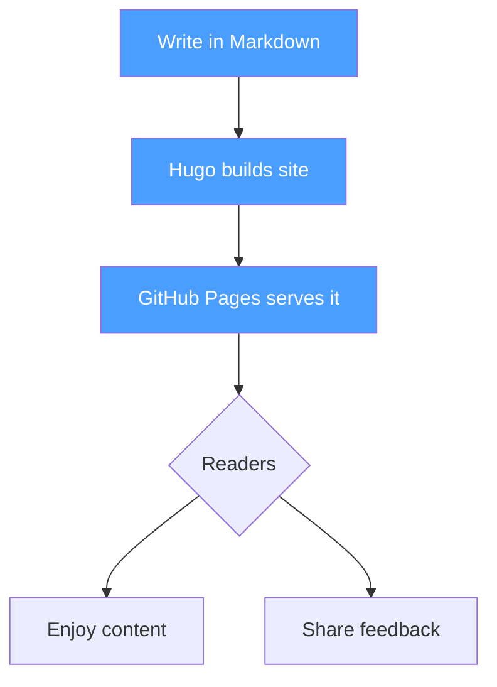
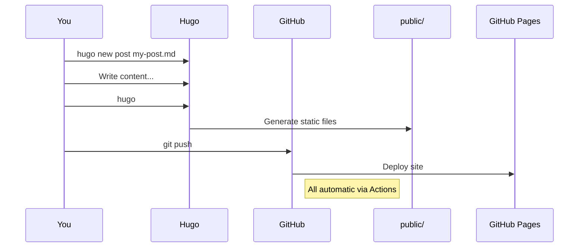
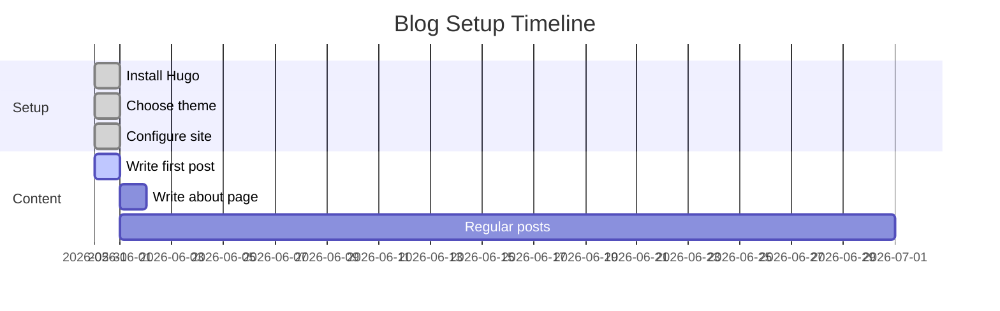
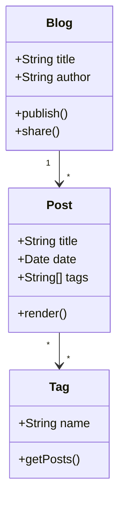

Welcome to the blog! This is the first post, and it doubles as a demo of what Hugo + PaperMod can do.

## Text

Write your thoughts in clean Markdown. Everything you'd expect works: **bold**, *italic*, `inline code`, [links](https://gohugo.io), blockquotes, lists, and more.

> The best time to start a blog was 10 years ago. The second best time is today.

## Code Blocks

```python
def fibonacci(n):
    a, b = 0, 1
    for _ in range(n):
        yield a
        a, b = b, a + b

print(list(fibonacci(10)))
# Output: [0, 1, 1, 2, 3, 5, 8, 13, 21, 34]
```

## Images

Hugo handles images natively with image processing. Drop an image in the page bundle and reference it:

```markdown

```

## Mermaid Diagrams

Mermaid diagrams are supported via a custom render hook. Write standard Mermaid syntax inside a fenced code block with the `mermaid` language:

### Flowchart



### Sequence Diagram



### Gantt Chart



### Class Diagram



---

That's it! More posts coming soon. 🚀
